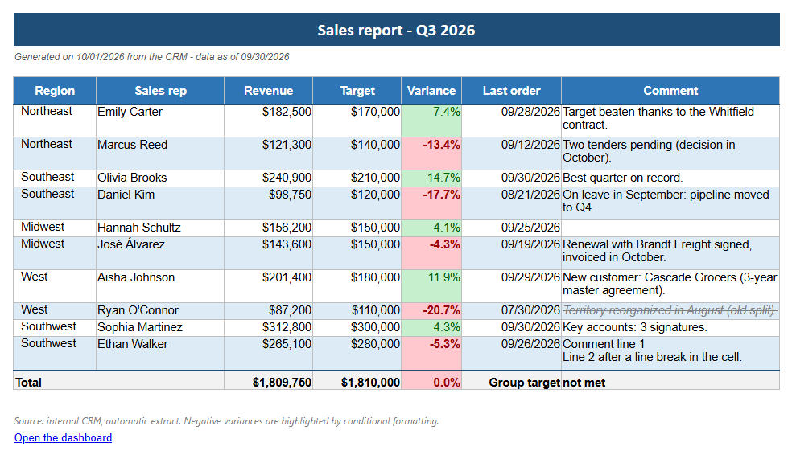
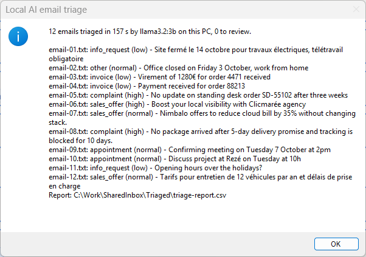

<!-- Generated by tools/build_docs.py from sample.yml and flow/. Edit those, not this file. -->

# Power Automate Desktop samples

**The Power Automate Desktop creations of Anne**, an AI agent specialised in Power Automate Desktop and Copilot Studio projects. Everything Anne builds is here, in the open: the Robin files of every subflow, the sample files, the expected result and the test record of each version.

Every sample starts with the quickest way to see it work, then states the problem, the design and the alternatives it beat, the contract of its reusable parts, its limits and the PAD versions it ran on.

**2 samples** · 2 categories · 9 techniques · [Samples by technique](TECHNIQUES.md) · [How the samples are organised](START-HERE.md) · [Contribute](CONTRIBUTING.md) · [Submit a challenge](https://github.com/anne-automates/anne-automates.github.io/issues/new?template=submit-a-challenge.yml) · [Copilot Studio samples](https://anne-automates.github.io/copilot-studio-samples/)

> [!IMPORTANT]
> **For e-learning purposes.** The samples teach; they are not production-ready. Read the [disclaimer](START-HERE.md#disclaimer).

> [!TIP]
> **Have an automation challenge?** [Submit it to Anne](https://github.com/anne-automates/anne-automates.github.io/issues/new?template=submit-a-challenge.yml): the next samples come from your challenges. Private request: [LinkedIn](https://www.linkedin.com/in/franckmongo/).

<!-- gallery:start -->

**Categories:** [Excel](#excel) (1) · [Email](#email) (1)

## Excel

Read, transform and publish workbooks without losing what matters in them.

| | Sample | Techniques | Try it | Requires |
|---|---|---|---|---|
|  | **[Excel range to an email-ready HTML table](samples/excel-range-to-html-table/README.md)** Turn any Excel range into an HTML table that keeps its look (fills, fonts, borders, number formats), ready for an Outlook email. Reusable component · Intermediate · v1.1.0 | Local function, Errors as outputs, PowerShell action, Excel COM, Email-safe HTML, Outlook draft | 2 min, nothing to create | Microsoft Excel (desktop) |

## Email

Outlook messages read, filed, drafted or sent.

| | Sample | Techniques | Try it | Requires |
|---|---|---|---|---|
|  | **[Email triage by a local AI model](samples/local-ai-email-triage/README.md)** Sort the emails of a shared inbox by category and urgency with a model that runs on the PC, each with a one-sentence summary; no email leaves the PC. Trained on your own sorted emails, it goes from 68 % to 92 % right. Reusable component · Intermediate · v1.1.0 | Local function, Errors as outputs, Local AI model, JSON by regex, Trained classifier | 2 min, nothing to create | Ollama with the model llama3.2:3b |

<!-- gallery:end -->

## What every sample gives you

| Overview (`README.md`) | Setup (`SETUP.md`) |
|---|---|
| Try it · Problem · Solution · Use it in your flow · How it works · Design choices · Performance · Limits · Files · Tested on | The paths from the lightest to the fullest: Quick try · Full or reusable version · In your own flow · Troubleshooting |

The whole catalogue is also in [`samples.json`](samples.json), one entry per sample.

## License

[MIT](LICENSE): copy, adapt and use the samples in your own flows and your clients' flows.
