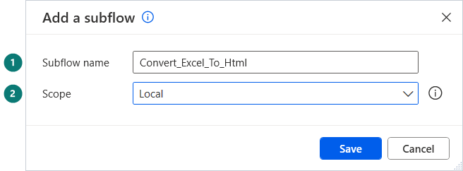

[⬅ Start here](../START-HERE.md)

# Create a subflow

A subflow is a tab next to `Main`. A sample's code calls it by its name, so the name must exist before the paste.

1. In the designer, open the **Subflows** list above the canvas, select **New**.
2. **Subflow name**: type the name given by the sample, exactly (capitals and underscores included).
3. **Scope**: *Global* unless the sample says **Local**. A local subflow is a function: it has its own inputs and outputs.
4. Wait a second after typing the name, check that the scope is still the one you chose, select **Save**.

A new tab opens next to `Main`. Paste the subflow's code into that tab, not into `Main`.

> [!WARNING]
> A wrong name gives errors after the paste of `Main` (the `CALL` line cannot find the subflow). Rename the tab, the errors disappear.
