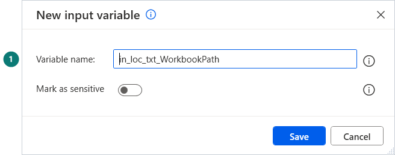
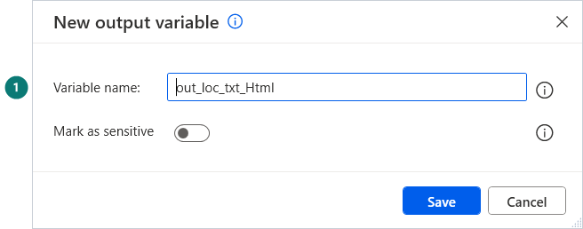

[⬅ Start here](../START-HERE.md)

# Create input and output variables

Most variables are created by the paste itself. Only **inputs and outputs** must exist before: a sample lists them in a table,
with the name to type, its type and an example value.

## For a local subflow (a function)

1. Open the tab of the subflow.
2. In the **Variables** pane on the right, select **Local**, then the blue **+** › **Input**.
3. Type the name only, select **Save**. Leave *Mark as sensitive* off.
4. Same gesture with **+** › **Output** for each output.

| New input variable | New output variable |
|---|---|
|  |  |

Check the counters of the pane: they must match the sample's table.

## For the whole flow

Variables pane › **Global** › **+** › Input or Output. Fill **Variable name**, **Data type** and **Default value** from the sample's table.

## Reading a name

`in_loc_txt_WorkbookPath` = an **in**put, **loc**al to its subflow, of type **t**e**xt**. The full key is in [Start here](../START-HERE.md#how-to-read-a-variable-name).
