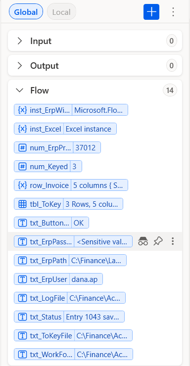
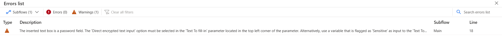

[⬅ Start here](../START-HERE.md)

# Sensitive values

A variable that holds a password should never show its value in the Variables pane or in the run logs.
PAD calls this **Mark as sensitive**. The setting does **not** travel with a paste: do it after every paste.

1. In the **Variables** pane, find the variable the sample names (e.g. `txt_ErpPassword`).
2. Right-click it, select **Mark as sensitive**. Its value now shows `<Sensitive value>`.

When a flow types into a password box, PAD shows this warning until the variable is sensitive:

> [!IMPORTANT]
> The samples only type practice passwords into the practice apps of `labs/`. For a real system, keep the password out of the flow:
> ask your admin which store your company uses (a credential store, an input variable filled at run time).
