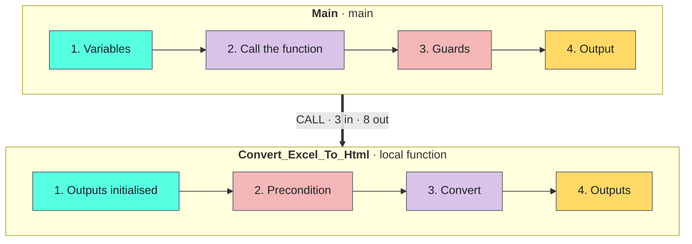

<!-- Generated by tools/build_docs.py from sample.yml and flow/. Edit those, not this file. -->

[All samples](../../README.md) › Excel

# Excel range to an email-ready HTML table

Turn any Excel range into an HTML table that keeps its look (fills, fonts, borders, number formats), ready for an Outlook email.

**Reusable component** · Intermediate · Requires Microsoft Excel (desktop) · Tested on PAD 2.72.183 · v1.1.0

[**Step-by-step setup**](SETUP.md) · [Download the sample (zip)](https://github.com/PowerAutomateDesktop-CopilotStudio/pad-samples/releases/download/excel-range-to-html-table-v1.1.0/excel-range-to-html-table-v1.1.0.zip) · [Changelog](CHANGELOG.md)

*For e-learning purposes only: try it in a test environment with the sample data, and review it before any real use. [Disclaimer](../../START-HERE.md#disclaimer)*

<br><sub>The HTML table returned by the function, same look</sub>

## Try it

From the path that asks the least to the one that asks the most. Stop at the one you need.

| Path | You create | Needs | Time |
|---|---|---|---|
| **[1. Quick try](SETUP.md#1-quick-try)**<br>The whole conversion in one block pasted into Main. No subflow, no input or output to create. | Nothing | Microsoft Excel (desktop) | 2 min |
| **[2. Reusable version](SETUP.md#2-reusable-version)**<br>The function and its example call, in a flow of their own. | 1 local subflow, 3 inputs, 8 outputs | Microsoft Excel (desktop) | 15 min |
| **[3. In your own flow](#use-it-in-your-flow)**<br>Call `Convert_Excel_To_Html` from the flow you are building. | The subflow, its 11 variables and one CALL line | Your flow | Depends on your flow |

## Problem

A report must reach its readers **as it looks in Excel**: fills, conditional colours, borders, number formats.
PAD has no action that reads the formatting of a cell (*Read from Excel worksheet* returns values only), and a range
pasted by hand into an email keeps its styles in a `<style>` block that Outlook on the web and on mobile drop.

## Solution

One *Run PowerShell script* action asks Excel itself. Excel, hidden and read-only, publishes the range as HTML with
its own engine; the script moves every CSS class inline on its cell, removes hidden rows and columns and the `mso-*`
rules, and writes every non-ASCII character as an entity. The action is wrapped in a **local function**
(3 inputs, 8 outputs) that never stops the flow: it returns a flag and a message.

**Kept:** Fills, fonts (name, size, colour, bold, italic, underline, strikethrough, rich text in a cell), alignment, wrap, indent, borders, merged cells, column widths, row heights, number formats as displayed, conditional formatting, hyperlinks.

**Techniques:** [Local function with a contract](../../TECHNIQUES.md#local-function) · [Errors returned, never thrown](../../TECHNIQUES.md#errors-as-outputs) · [One PowerShell action for what PAD cannot do](../../TECHNIQUES.md#powershell-script) · [Excel driven through COM](../../TECHNIQUES.md#excel-com) · [Email-safe HTML](../../TECHNIQUES.md#email-safe-html) · [Outlook draft instead of a send](../../TECHNIQUES.md#outlook-draft)

## Use it in your flow

1. Create the local subflow `Convert_Excel_To_Html` and its 3 inputs and 8 outputs ([how](SETUP.md#2-reusable-version)).
2. Paste [`flow/2-Convert_Excel_To_Html.txt`](flow/2-Convert_Excel_To_Html.txt) into it (44 lines).
3. Call it. The example in `Main`:

```text
CALL Convert_Excel_To_Html in_loc_txt_WorkbookPath: txt_WorkbookPath in_loc_txt_SheetName: txt_SheetName in_loc_txt_RangeAddress: txt_RangeAddress out_loc_txt_Html=> txt_Html out_loc_bool_Ok=> bool_Ok out_loc_txt_Error=> txt_Error out_loc_txt_SheetName=> txt_UsedSheetName out_loc_txt_RangeAddress=> txt_UsedRangeAddress out_loc_num_RowCount=> num_RowCount out_loc_num_ColumnCount=> num_ColumnCount out_loc_num_ElapsedMs=> num_ElapsedMs
```

| Inputs | Type | Description | Example |
|---|---|---|---|
| `in_loc_txt_WorkbookPath` | Text | Full path of the workbook | `C:\Reports\Sales\Sales_Report_2026-Q3.xlsx` |
| `in_loc_txt_SheetName` | Text | Sheet to read; empty = the sheet active when the workbook was saved | `Q3 Sales` |
| `in_loc_txt_RangeAddress` | Text | Range to read; empty = the used range | `A1:H19` |

| Outputs | Type | Description | Example |
|---|---|---|---|
| `out_loc_txt_Html` | Text | The HTML table with inline styles | `<table style="border-collapse:collapse;...` |
| `out_loc_bool_Ok` | Boolean | True when the conversion worked | `True` |
| `out_loc_txt_Error` | Text | Why it failed; empty when out_loc_bool_Ok is True | `Workbook not found: C:\Reports\Sales\Q3.xlsx` |
| `out_loc_txt_SheetName` | Text | The sheet really read | `Q3 Sales` |
| `out_loc_txt_RangeAddress` | Text | The range really read | `A1:H19` |
| `out_loc_num_RowCount` | Number | Visible rows in the table | `18` |
| `out_loc_num_ColumnCount` | Number | Visible columns in the table | `7` |
| `out_loc_num_ElapsedMs` | Number | Time taken by the conversion | `8550` |

> [!TIP]
> `Convert_Excel_To_Html` never stops the flow. Test `out_loc_bool_Ok` after the call and read `out_loc_txt_Error` when it is False.

## How it works



`Convert_Excel_To_Html`, region by region:

1. **Outputs initialised**: every path leaves them defined
2. **Precondition**: a missing workbook is reported, never thrown
3. **Convert**: Excel publishes the range, the script inlines the CSS; the first line of the output carries the details
4. **Outputs**: the details line (tab-separated: name, sheet, range, rows, columns, milliseconds), then the HTML table

## Design choices

Measured 2026-09-08, on the sample workbook (126 visible cells).

| Approach | Time | Result | Verdict |
|---|---|---|---|
| Native: Read from Excel worksheet + an HTML template | 0.06 s | Values only. No colour, font or border. | Use it when you impose your own style, not to keep the workbook's. |
| Excel publishes the range (PublishObjects) and nothing else | 0.26 s | All formatting, but as CSS classes in a `<style>` block; hidden cells emitted; windows-1252. | Excellent raw material. Needs the rewrite below. |
| Clipboard HTML after Range.Copy (what a manual paste uses) | 0.67 s | The same class-based HTML. | Rejected: it overwrites the user's clipboard. |
| Cell by cell through COM (DisplayFormat) | 18 to 29 s | Faithful, inline CSS. | Rejected: about 70 ms per cell, over two minutes for 2,000 cells. |
| A picture of the range | 1.9 s | Pixel-exact PNG. | Rejected for a table: no search, no copy, images often blocked. |
| **Chosen: Excel publishes, the script inlines the CSS** | about 10 s | All formatting, inline CSS, hidden cells removed, entities. | The time does not depend on the size of the range. |

## Performance

- About 10 s per call whatever the size of the range: Excel start 3.6 s, workbook open 1.6 s, publish 1.6 s, read 0.2 s, rewrite 1.3 s, close 0.3 s (profile of 2026-09-08).
- Tested run of 2026-09-26: 18 rows x 7 columns converted in 8.55 s, HTML table of 37,397 characters.

## Limits

- Needs the desktop Excel on the PC (COM). The Outlook option of the quick try needs the classic Outlook with a profile; the new Outlook has no COM and no PAD action.
- Not kept: images, charts, shapes, icon sets, data bars, comments (no HTML equivalent in an email).
- The workbook path must not contain an apostrophe (it is interpolated in a PowerShell string).
- Script actions can be blocked by a data loss prevention (DLP) policy of the tenant.
- Checked in Outlook desktop and in a browser. Outlook on the web, mobile and Gmail were not tested; the output is plain inline-styled table HTML, the most portable form.
- A wide range gives a wide email: Excel's column widths are kept (952 px for the sample).

## Files

| Subflow | Scope | Lines | Role |
|---|---|---|---|
| [`Main`](flow/1-Main.txt) | Main | 34 | Example call: sets the workbook, sheet, range and output folder, calls the function, writes the HTML file. |
| [`Convert_Excel_To_Html`](flow/2-Convert_Excel_To_Html.txt) | Local | 44 | The reusable part: 3 values in, the HTML table and 7 details out. Never stops the flow. |
| [`Test`](flow/3-Test.txt) | Global | 77 | The quick try: the whole conversion in one block, the table opened in the browser (or an Outlook draft). *(optional)* |

- Sample files, in [`input/`](input/): `Sales_Report_2026-Q3.xlsx`
- Output of the test run, in [`expected/`](expected/): `Sales_Report_2026-Q3_table.html`

## Tested on

| PAD version | Date | Path | Result |
|---|---|---|---|
| 2.72.183 | 2026-09-26 | Full flow | Pass |
| 2.72.183 | 2026-09-29 | Quick try | Pass |

Authors: HyperAutomatisation · [Changelog](CHANGELOG.md) · [Report a problem](https://github.com/PowerAutomateDesktop-CopilotStudio/pad-samples/issues/new?template=sample-does-not-work.yml&title=%5Bexcel-range-to-html-table%5D+)
