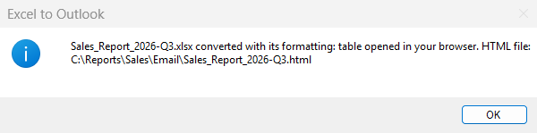
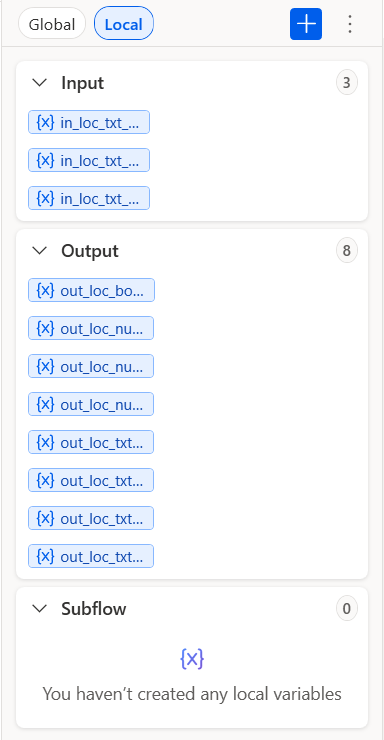
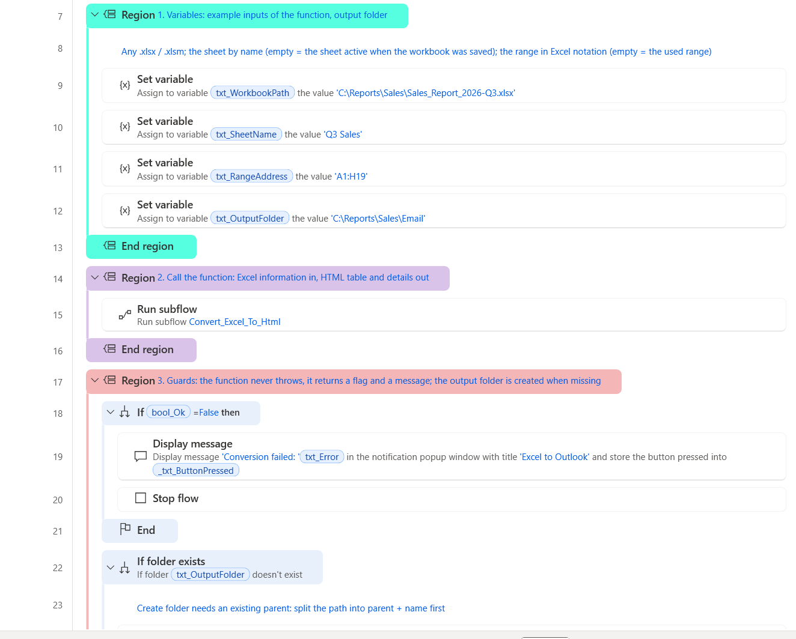
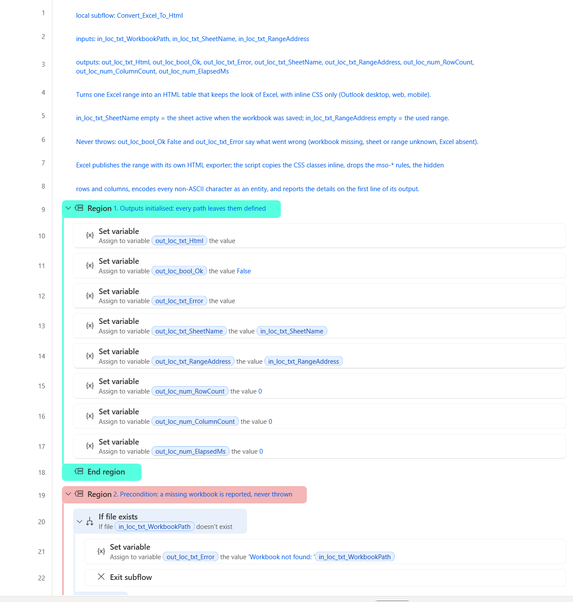
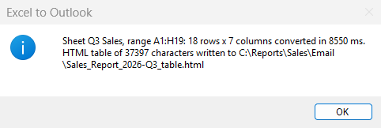

<!-- Generated by tools/build_docs.py from sample.yml and flow/. Edit those, not this file. -->

[All samples](../../README.md) › [Excel range to an email-ready HTML table](README.md) › Setup

# Set up: Excel range to an email-ready HTML table

Tested on PAD 2.72.183 · v1.1.1

*For e-learning purposes only: try it in a test environment with the sample data, and review it before any real use. [Disclaimer](../../START-HERE.md#disclaimer)*

From the path that asks the least to the one that asks the most. Stop at the one you need.

| Path | You create | Needs | Time |
|---|---|---|---|
| **[1. Quick try](#1-quick-try)**<br>The whole conversion in one block pasted into Main. No subflow, no input or output to create. | Nothing | Microsoft Excel (desktop) | 2 min |
| **[2. Reusable version](#2-reusable-version)**<br>The function and its example call, in a flow of their own. | 1 local subflow, 3 inputs, 8 outputs | Microsoft Excel (desktop) | 15 min |
| **[3. In your own flow](#3-in-your-own-flow)**<br>Call `Convert_Excel_To_Html` from the flow you are building. | The subflow, its 11 variables and one CALL line | Your flow | Depends on your flow |

## 1. Quick try

The whole conversion in one block pasted into Main. No subflow, no input or output to create. Needs Microsoft Excel (desktop).

### 1.1 Prepare the files

- Copy [`input/Sales_Report_2026-Q3.xlsx`](input/Sales_Report_2026-Q3.xlsx) into `C:\Reports\Sales`. Create the folder first. The flow creates C:\Reports\Sales\Email by itself.

### 1.2 Paste the block into Main

**+ New flow**, any name, **Create**. Click the empty canvas of `Main`, **Ctrl+V** the block of [`flow/3-Test.txt`](flow/3-Test.txt). Check: 77 lines, Errors pane empty.

<details><summary>The code (77 lines)</summary>

```text
# subflow: Test (global)
# Excel to HTML - the quick try, AUTONOMOUS: any workbook range becomes an HTML table that keeps the look of Excel
# (fills, fonts, borders, merged cells, column widths, number formats, conditional formatting, hyperlinks). The table opens in the
# browser; with bool_SendToOutlook = True it also lands in an Outlook draft (classic Outlook only).
# NO input / output variable: the parameters are plain SET lines in the first region, so this subflow can be pasted alone
# into any empty Main. Or run it here with 'Run from here' on its first action.
# The reusable building block is the local function Convert_Excel_To_Html (same script), called by Main.
# PAD has no action that reads the formatting of a cell: ONE 'Run PowerShell script' action asks Excel itself
# (COM, DisplayFormat) and returns a table with inline CSS, the only styling that every Outlook client keeps.
# Everything else is native: guards, HTML file, browser or Outlook, final message. Regions: cyan values, red guards, purple processing, gold output.
@@regionColor: '#57FFE1'
**REGION 1. Variables: parameters, the only lines to change
# The workbook to send: any .xlsx / .xlsm, opened read-only, never modified
SET txt_WorkbookPath TO $'''C:\\Reports\\Sales\\Sales_Report_2026-Q3.xlsx'''
# Worksheet name; empty = the sheet that was active when the workbook was saved
SET txt_SheetName TO $''''''
# Range to export in Excel notation (A1:H18); empty = the used range of the sheet
SET txt_RangeAddress TO $''''''
# Folder that receives the HTML file (it opens in your browser at the end)
SET txt_OutputFolder TO $'''C:\\Reports\\Sales\\Email'''
# False = only the HTML file, opened in the browser (needs Excel only); True = also an email through the classic Outlook
SET bool_SendToOutlook TO False
# Used when bool_SendToOutlook is True: Outlook account that sends (as listed in Outlook), recipients, subject, text above the table (HTML allowed)
SET txt_OutlookAccount TO $'''your.name@example.com'''
SET txt_EmailTo TO $'''sales-managers@example.com'''
SET txt_EmailSubject TO $'''Sales report Q3 2026 - straight from Excel'''
SET txt_EmailIntro TO $'''Hello,<br><br>Please find below the sales report of the quarter, exactly as it looks in the workbook.'''
# True = the email is saved in the Drafts folder and opened on screen (demo: nothing leaves the mailbox); False = it is sent
SET bool_DraftOnly TO True
**ENDREGION
@@regionColor: '#F4B6B6'
**REGION 2. Preconditions: a missing workbook is said clearly, a missing output folder is created
IF (File.IfFile.DoesNotExist File: txt_WorkbookPath) THEN
    Display.ShowMessageDialog.ShowMessage Title: $'''Excel to Outlook''' Message: $'''Workbook not found: %txt_WorkbookPath%. Fix txt_WorkbookPath in the first region of this subflow, then run again.''' Icon: Display.Icon.ErrorIcon Buttons: Display.Buttons.OK DefaultButton: Display.DefaultButton.Button1 IsTopMost: True ButtonPressed=> _txt_ButtonPressed
    EXIT Code: 0
END
IF (Folder.IfFolderExists.DoesNotExist Path: txt_OutputFolder) THEN
    # Create folder needs an existing parent: split the path into parent + name first
    File.GetPathPart File: txt_OutputFolder Directory=> fold_OutputParent FileName=> txt_OutputFolderName
    Folder.Create FolderPath: fold_OutputParent FolderName: txt_OutputFolderName Folder=> _fold_Output
END
**ENDREGION
@@regionColor: '#D9C3E9'
**REGION 3. Convert: Excel renders the range, the script writes it as an HTML table with inline styles
# The same script as in Convert_Excel_To_Html, without the details line; its parameters come from the variables above
Scripting.RunPowershellScript.RunScript Script: $'''# Excel to HTML - turns an Excel range into an HTML table that keeps the look of Excel and survives Outlook.
# How: Excel itself publishes the range as HTML (PublishObjects, its \'Save as web page\' engine: one call, a few
# hundred milliseconds whatever the size), then this script rewrites that HTML for email: the CSS classes of the
# <style> block are copied INLINE on every cell (Outlook on the web, mobile and Gmail drop most <style> rules),
# the mso-* rules, hidden rows and hidden columns are removed, the table is rebuilt clean, every non-ASCII
# character becomes a numeric entity so that encodings never matter.
# Kept: fills, fonts (name, size, colour, bold, italic, underline, strikethrough, rich text runs), alignment, wrap,
#        indent, borders, merged cells, column widths, row heights, number formats, conditional formatting, hyperlinks.
# Not kept: images, charts, shapes, icon sets, data bars, comments (no HTML equivalent in an email).
# ASCII only on purpose: the same text lives inside a Robin literal and inside a PowerShell action.
# --- parameters : taken from the Variables region of Test ---
$WorkbookPath = \'%txt_WorkbookPath%\'
$SheetName = \'%txt_SheetName%\'
$RangeAddress = \'%txt_RangeAddress%\'
$OutputPath = \'\'
$DetailsLine = \'\'
# --- end parameters ---
$ErrorActionPreference = \'Stop\'
$clock = [System.Diagnostics.Stopwatch]::StartNew()

function Split-Declarations([string]$block) {
    # \'color:black; mso-number-format:\"0\\.0%%\"; border:.5pt solid #BFBFBF\' -> ordered map, quote-aware, mso-* dropped
    $map = New-Object System.Collections.Specialized.OrderedDictionary
    if ([string]::IsNullOrEmpty($block)) { return $map }
    $parts = New-Object System.Collections.ArrayList
    $sb = New-Object System.Text.StringBuilder
    $inQuote = $false
    foreach ($ch in $block.ToCharArray()) {
        if ($ch -eq \'\"\') { $inQuote = -not $inQuote }
        if ($ch -eq \';\' -and -not $inQuote) { [void]$parts.Add($sb.ToString()); [void]$sb.Clear() } else { [void]$sb.Append($ch) }
    }
    [void]$parts.Add($sb.ToString())
    foreach ($p in $parts) {
        $idx = $p.IndexOf(\':\')
        if ($idx -lt 1) { continue }
        $k = $p.Substring(0, $idx).Trim().ToLowerInvariant()
        $v = $p.Substring($idx + 1).Trim()
        if ($k -eq \'\' -or $v -eq \'\' -or $k.StartsWith(\'mso-\')) { continue }
        $map[$k] = $v
    }
    return $map
}

function Merge-Into($target, $source) {
    if ($source -ne $null) { foreach ($k in @($source.Keys)) { $target[$k] = $source[$k] } }
}

function Parse-Attributes([string]$attrText) {
    # class=xl65 width=103 style=\'height:15.0pt\' x:num=\"182500\" -> hashtable (names lower-cased)
    $map = @{}
    $pattern = \'([A-Za-z][\\w:-]*)\\s*=\\s*(?:\"([^\"]*)\"|\' + \"\'([^\']*)\'\" + \'|([^\\s>]+))\'
    foreach ($m in [regex]::Matches($attrText, $pattern)) {
        $name = $m.Groups[1].Value.ToLowerInvariant()
        $val = $m.Groups[2].Value
        if ($m.Groups[3].Success) { $val = $m.Groups[3].Value }
        if ($m.Groups[4].Success) { $val = $m.Groups[4].Value }
        $map[$name] = $val
    }
    return $map
}

function Inline-Style($rules, [hashtable]$attrs, [string]$tag) {
    # tag rule, then the class rules, then the inline style: the later wins, like the cascade did
    $style = New-Object System.Collections.Specialized.OrderedDictionary
    if ($rules.ContainsKey($tag)) { Merge-Into $style $rules[$tag] }
    if ($attrs.ContainsKey(\'class\')) {
        foreach ($cls in ($attrs[\'class\'] -split \'\\s+\')) {
            $key = \'.\' + $cls
            if ($rules.ContainsKey($key)) { Merge-Into $style $rules[$key] }
        }
    }
    if ($attrs.ContainsKey(\'style\')) { Merge-Into $style (Split-Declarations $attrs[\'style\']) }
    $out = New-Object System.Text.StringBuilder
    foreach ($k in @($style.Keys)) {
        $v = [string]$style[$k]
        if ($k -eq \'text-align\' -and $v -eq \'general\') { continue }
        if ($k -eq \'display\') { continue }
        $v = $v.Replace(\'windowtext\', \'#000000\').Replace(\'\"\', \"\'\")
        [void]$out.Append($k + \':\' + $v + \';\')
    }
    return $out.ToString()
}

function Inline-Content($rules, [string]$inner) {
    # rich text runs (<font class=font5>), spans and links inside a cell get their style inline too
    $sbEval = {
        param($m)
        $tag = $m.Groups[1].Value.ToLowerInvariant()
        $a = Parse-Attributes $m.Groups[2].Value
        $style = Inline-Style $rules $a $tag
        $keep = \'\'
        if ($a.ContainsKey(\'href\')) { $keep += \' href=\"\' + $a[\'href\'] + \'\"\' }
        if ($tag -eq \'font\') { $tag = \'span\' }
        if ($style -ne \'\') { return (\'<\' + $tag + $keep + \' style=\"\' + $style + \'\">\') }
        return (\'<\' + $tag + $keep + \'>\')
    }.GetNewClosure()
    $evaluator = [System.Text.RegularExpressions.MatchEvaluator]$sbEval
    $s = [regex]::Replace($inner, \'(?is)<(font|span|a)\\b([^>]*)>\', $evaluator)
    $s = [regex]::Replace($s, \'(?i)</font>\', \'</span>\')
    $s = [regex]::Replace($s, \'\\s*\\r?\\n\\s*\', \' \')
    return $s.Trim()
}

function Encode-NonAscii([string]$s) {
    $sb = New-Object System.Text.StringBuilder
    $i = 0
    while ($i -lt $s.Length) {
        $ch = $s[$i]
        if ([char]::IsHighSurrogate($ch) -and ($i + 1) -lt $s.Length) {
            [void]$sb.Append(\'&#\' + [char]::ConvertToUtf32($s, $i) + \';\')
            $i += 2
            continue
        }
        $code = [int]$ch
        if ($code -gt 126) { [void]$sb.Append(\'&#\' + $code + \';\') } else { [void]$sb.Append($ch) }
        $i++
    }
    return $sb.ToString()
}

$excel = $null
$wb = $null
$tmp = \'\'
try {
    if (-not (Test-Path -LiteralPath $WorkbookPath)) { throw (\'Workbook not found: \' + $WorkbookPath) }

    # 1. Excel publishes the range: its own exporter, one call, conditional formatting and number formats resolved
    $excel = New-Object -ComObject Excel.Application
    $excel.Visible = $false
    $excel.DisplayAlerts = $false
    $wb = $excel.Workbooks.Open($WorkbookPath, 0, $true)
    if ($SheetName -ne \'\') {
        try { $ws = $wb.Worksheets.Item($SheetName) } catch { throw (\'Worksheet not found: \' + $SheetName) }
    } else { $ws = $wb.ActiveSheet }
    if ($RangeAddress -ne \'\') {
        try { $rng = $ws.Range($RangeAddress) } catch { throw (\'Range not valid: \' + $RangeAddress) }
    } else { $rng = $ws.UsedRange }
    $address = [string]$rng.Address($false, $false)
    $sheetUsed = [string]$ws.Name
    $base = \'excel-to-html-\' + [guid]::NewGuid().ToString(\'N\')
    $tmp = Join-Path $env:TEMP ($base + \'.htm\')
    $po = $wb.PublishObjects.Add(4, $tmp, $ws.Name, $address, 0, \'ExcelToOutlook\', \'\')
    $po.Publish($true)
    $wb.Close($false)
    $wb = $null
    $bytes = [System.IO.File]::ReadAllBytes($tmp)
    $head = [System.Text.Encoding]::ASCII.GetString($bytes, 0, [Math]::Min(4096, $bytes.Length))
    $encoding = [System.Text.Encoding]::GetEncoding(1252)
    if ($head -match \'(?i)charset=([\\w-]+)\') { try { $encoding = [System.Text.Encoding]::GetEncoding($Matches[1]) } catch { } }
    $html = $encoding.GetString($bytes)

    # 2. The CSS rules of the <style> block, selector by selector (td, .xl65 ...), mso-* already dropped
    $rules = @{}
    $mStyle = [regex]::Match($html, \'(?is)<style[^>]*>(.*?)</style>\')
    if ($mStyle.Success) {
        $styleBlock = $mStyle.Groups[1].Value.Replace(\'<!--\', \' \').Replace(\'-->\', \' \')
        foreach ($m in [regex]::Matches($styleBlock, \'(?s)([^{}]+)\\{([^{}]*)\\}\')) {
            $decl = Split-Declarations $m.Groups[2].Value
            foreach ($sel in ($m.Groups[1].Value -split \',\')) {
                $s = $sel.Trim()
                if ($s -eq \'\') { continue }
                if (-not $rules.ContainsKey($s)) { $rules[$s] = New-Object System.Collections.Specialized.OrderedDictionary }
                Merge-Into $rules[$s] $decl
            }
        }
    }

    # 3. The table alone, without the Office conditional comments
    $mTable = [regex]::Match($html, \'(?is)<table\\b[^>]*>.*?</table>\')
    if (-not $mTable.Success) { throw \'Excel produced no table for this range\' }
    $table = $mTable.Value
    $table = [regex]::Replace($table, \'(?is)<!\\[if\\s+supportMisalignedColumns\\]>.*?<!\\[endif\\]>\', \'\')
    $table = [regex]::Replace($table, \'(?s)<!--.*?-->\', \'\')
    $table = [regex]::Replace($table, \'(?s)<!\\[(?:if|endif)[^\\]]*\\]>\', \'\')

    # 4. Columns: width and hidden state (Excel writes a hidden column as width=0 / display:none)
    $colHidden = New-Object System.Collections.ArrayList
    $colWidth = New-Object System.Collections.ArrayList
    foreach ($m in [regex]::Matches($table, \'(?i)<col\\b([^>]*)>\')) {
        $a = Parse-Attributes $m.Groups[1].Value
        $span = 1
        if ($a.ContainsKey(\'span\')) { $span = [int]$a[\'span\'] }
        $w = 0
        if ($a.ContainsKey(\'width\')) { $w = [int]$a[\'width\'] }
        $hidden = ($w -le 0) -or ($a.ContainsKey(\'style\') -and $a[\'style\'] -match \'display\\s*:\\s*none\')
        for ($i = 0; $i -lt $span; $i++) { [void]$colHidden.Add($hidden); [void]$colWidth.Add($w) }
    }
    $totalWidth = 0
    $colVisible = 0
    for ($i = 0; $i -lt $colWidth.Count; $i++) { if (-not $colHidden[$i]) { $totalWidth += $colWidth[$i]; $colVisible++ } }
    $rowCount = 0

    # 5. Rows and cells: classes inlined, hidden rows and columns skipped, spans kept
    $out = New-Object System.Text.StringBuilder
    [void]$out.Append(\'<table border=\"0\" cellpadding=\"0\" cellspacing=\"0\" width=\"\' + $totalWidth + \'\" style=\"border-collapse:collapse;table-layout:fixed;width:\' + $totalWidth + \'px;mso-table-lspace:0pt;mso-table-rspace:0pt;\">\')
    for ($i = 0; $i -lt $colWidth.Count; $i++) { if (-not $colHidden[$i]) { [void]$out.Append(\'<col width=\"\' + $colWidth[$i] + \'\">\') } }
    [void]$out.AppendLine()
    $rowspanLeft = New-Object int[] 1024
    foreach ($mr in [regex]::Matches($table, \'(?is)<tr\\b([^>]*)>(.*?)</tr>\')) {
        $ra = Parse-Attributes $mr.Groups[1].Value
        $rowHidden = ($ra.ContainsKey(\'style\') -and $ra[\'style\'] -match \'display\\s*:\\s*none\')
        $rowStyle = \'\'
        if ($ra.ContainsKey(\'style\')) {
            $rd = Split-Declarations $ra[\'style\']
            if ($rd.Contains(\'height\')) { $rowStyle = \'height:\' + $rd[\'height\'] + \';\' }
        }
        $rowAttrs = \'\'
        if ($ra.ContainsKey(\'height\')) { $rowAttrs = \' height=\"\' + $ra[\'height\'] + \'\"\' }
        $pos = 0
        $cells = New-Object System.Text.StringBuilder
        foreach ($mc in [regex]::Matches($mr.Groups[2].Value, \'(?is)<td\\b([^>]*)>(.*?)</td>\')) {
            while ($pos -lt $rowspanLeft.Length -and $rowspanLeft[$pos] -gt 0) { $pos++ }
            $ca = Parse-Attributes $mc.Groups[1].Value
            $colspan = 1
            if ($ca.ContainsKey(\'colspan\')) { $colspan = [int]$ca[\'colspan\'] }
            $rowspan = 1
            if ($ca.ContainsKey(\'rowspan\')) { $rowspan = [int]$ca[\'rowspan\'] }
            $visible = 0
            $wsum = 0
            for ($i = $pos; $i -lt ($pos + $colspan); $i++) {
                if ($i -lt $colHidden.Count) { if (-not $colHidden[$i]) { $visible++; $wsum += $colWidth[$i] } } else { $visible++ }
            }
            if ($rowspan -gt 1) { for ($i = $pos; $i -lt ($pos + $colspan) -and $i -lt $rowspanLeft.Length; $i++) { $rowspanLeft[$i] = $rowspan } }
            $pos += $colspan
            if ($visible -eq 0 -or $rowHidden) { continue }
            $attrText = \'\'
            if ($visible -gt 1) { $attrText += \' colspan=\"\' + $visible + \'\"\' }
            if ($rowspan -gt 1) { $attrText += \' rowspan=\"\' + $rowspan + \'\"\' }
            if ($wsum -gt 0) { $attrText += \' width=\"\' + $wsum + \'\"\' }
            if ($ca.ContainsKey(\'height\')) { $attrText += \' height=\"\' + $ca[\'height\'] + \'\"\' }
            if ($ca.ContainsKey(\'align\')) { $attrText += \' align=\"\' + $ca[\'align\'] + \'\"\' }
            if ($ca.ContainsKey(\'valign\')) { $attrText += \' valign=\"\' + $ca[\'valign\'] + \'\"\' }
            $style = Inline-Style $rules $ca \'td\'
            $content = Inline-Content $rules $mc.Groups[2].Value
            if ($content -eq \'\') { $content = \'&nbsp;\' }
            [void]$cells.Append(\'<td\' + $attrText + \' style=\"\' + $style + \'\">\' + $content + \'</td>\')
        }
        for ($i = 0; $i -lt $rowspanLeft.Length; $i++) { if ($rowspanLeft[$i] -gt 0) { $rowspanLeft[$i]-- } }
        if ($rowHidden) { continue }
        [void]$out.Append(\'<tr\' + $rowAttrs + \' style=\"\' + $rowStyle + \'\">\' + $cells.ToString() + \'</tr>\')
        [void]$out.AppendLine()
        $rowCount++
    }
    [void]$out.Append(\'</table>\')
    $result = Encode-NonAscii $out.ToString()
    if ($OutputPath -ne \'\') { [System.IO.File]::WriteAllText($OutputPath, $result, [System.Text.Encoding]::ASCII) }
    if ($DetailsLine -ne \'\') {
        $tab = [string][char]9
        Write-Output (\'excel-to-html\' + $tab + $sheetUsed + $tab + $address + $tab + $rowCount + $tab + $colVisible + $tab + $clock.ElapsedMilliseconds)
    }
    Write-Output $result
}
catch {
    [Console]::Error.WriteLine(\'excel-to-html : \' + $_.Exception.Message)
}
finally {
    if ($wb -ne $null) { $wb.Close($false) }
    if ($excel -ne $null) {
        $excel.Quit()
        [void][System.Runtime.InteropServices.Marshal]::ReleaseComObject($excel)
    }
    [GC]::Collect()
    [GC]::WaitForPendingFinalizers()
    if ($tmp -ne \'\' -and (Test-Path -LiteralPath $tmp)) { Remove-Item -LiteralPath $tmp -Force -ErrorAction SilentlyContinue }
    if ($tmp -ne \'\') {
        $stem = [System.IO.Path]::GetFileNameWithoutExtension($tmp)
        Get-ChildItem -LiteralPath $env:TEMP -Directory -Filter ($stem + \'_*\') -ErrorAction SilentlyContinue | Remove-Item -Recurse -Force -ErrorAction SilentlyContinue
    }
}''' ScriptOutput=> txt_HtmlTable ScriptError=> txt_ScriptError
# The output ends with a line break that would land in the email
Text.Trim Text: txt_HtmlTable TrimOption: Text.TrimOption.Both TrimmedText=> txt_HtmlTable
**ENDREGION
@@regionColor: '#F4B6B6'
**REGION 4. Guard: the action never fails by itself, a script error only fills ScriptError
IF txt_ScriptError <> $'''''' THEN
    Display.ShowMessageDialog.ShowMessage Title: $'''Excel to Outlook''' Message: $'''The conversion failed: %txt_ScriptError%''' Icon: Display.Icon.ErrorIcon Buttons: Display.Buttons.OK DefaultButton: Display.DefaultButton.Button1 IsTopMost: True ButtonPressed=> _txt_ButtonPressed
    EXIT Code: 1
END
**ENDREGION
@@regionColor: '#FFD966'
**REGION 5. Output: the HTML file, and the email when Outlook is asked
File.GetPathPart File: txt_WorkbookPath FileName=> txt_WorkbookName FileNameWithoutExtension=> txt_WorkbookBaseName
SET txt_HtmlFile TO $'''%txt_OutputFolder%\\%txt_WorkbookBaseName%.html'''
# Inline styles only: Outlook desktop, Outlook on the web and the mobile apps drop most <style> rules
SET txt_EmailBody TO $'''<html><body style=\"font-family:Calibri,Arial,sans-serif;font-size:11pt;color:#000000;\"><p>%txt_EmailIntro%</p>%txt_HtmlTable%<p style=\"font-size:9pt;color:#7F7F7F;\">Generated by Power Automate Desktop from %txt_WorkbookName%</p></body></html>'''
File.WriteText File: txt_HtmlFile TextToWrite: txt_EmailBody AppendNewLine: False IfFileExists: File.IfFileExists.Overwrite Encoding: File.FileEncoding.UTF8
IF bool_SendToOutlook = True THEN
    Outlook.Launch Instance=> inst_Outlook
    Outlook.SendEmailThroughOutlook.SendEmail Instance: inst_Outlook Account: txt_OutlookAccount SendTo: txt_EmailTo Subject: txt_EmailSubject Body: txt_EmailBody IsBodyHtml: True IsDraft: bool_DraftOnly
END
**ENDREGION
@@regionColor: '#FFD966'
**REGION 6. Report: show the result (the browser, or the Outlook draft), then say what happened
IF bool_SendToOutlook = False THEN
    # The default browser opens the HTML file: the table as the reader of the email will see it
    System.RunApplication.RunApplication ApplicationPath: txt_HtmlFile WindowStyle: System.ProcessWindowStyle.Normal ProcessId=> _num_BrowserProcess
    SET txt_Outcome TO $'''table opened in your browser'''
ELSE IF bool_DraftOnly = True THEN
    # PAD saves the draft but cannot open it: a few lines of PowerShell ask Outlook to display the newest draft with this subject
    Scripting.RunPowershellScript.RunScript Script: $'''$outlook = New-Object -ComObject Outlook.Application
$drafts = $outlook.Session.GetDefaultFolder(16).Items
$drafts.Sort(\"[LastModificationTime]\", $true)
$mail = $drafts.Find(\"[Subject] = \'%txt_EmailSubject%\'\")
if ($mail -ne $null) { $mail.Display() ; Write-Output \'displayed\' } else { Write-Output \'not found\' }''' ScriptOutput=> _txt_DisplayOutput ScriptError=> _txt_DisplayError
    SET txt_Outcome TO $'''email saved as a draft (Outlook, Drafts folder) and opened on screen'''
ELSE
    SET txt_Outcome TO $'''email sent to %txt_EmailTo%'''
END
Display.ShowMessageDialog.ShowMessage Title: $'''Excel to Outlook''' Message: $'''%txt_WorkbookName% converted with its formatting: %txt_Outcome%. HTML file: %txt_HtmlFile%''' Icon: Display.Icon.Information Buttons: Display.Buttons.OK DefaultButton: Display.DefaultButton.Button1 IsTopMost: True ButtonPressed=> _txt_ButtonPressed
**ENDREGION
```

</details>

### 1.3 Run and check

**Run**. Expected:

- Your browser opens C:\Reports\Sales\Email\Sales_Report_2026-Q3.html: the table with the look of the workbook.
- A message: Sales_Report_2026-Q3.xlsx converted with its formatting: table opened in your browser.

<br><sub>The message at the end of the quick try</sub>

The values to change are in the first region of `Test` (cyan):

| Variable | Value in the sample | What it is |
|---|---|---|
| `txt_WorkbookPath` | `C:\Reports\Sales\Sales_Report_2026-Q3.xlsx` | The workbook to send: any .xlsx / .xlsm, opened read-only, never modified |
| `txt_SheetName` | *(empty)* | Worksheet name; empty = the sheet that was active when the workbook was saved |
| `txt_RangeAddress` | *(empty)* | Range to export in Excel notation (A1:H18); empty = the used range of the sheet |
| `txt_OutputFolder` | `C:\Reports\Sales\Email` | Folder that receives the HTML file (it opens in your browser at the end) |
| `bool_SendToOutlook` | `False` | False = only the HTML file, opened in the browser (needs Excel only); True = also an email through the classic Outlook |
| `txt_OutlookAccount` | `your.name@example.com` | Used when bool_SendToOutlook is True: Outlook account that sends (as listed in Outlook), recipients, subject, text above the table (HTML allowed) |
| `txt_EmailTo` | `sales-managers@example.com` | Used when bool_SendToOutlook is True: Outlook account that sends (as listed in Outlook), recipients, subject, text above the table (HTML allowed) |
| `txt_EmailSubject` | `Sales report Q3 2026 - straight from Excel` | Used when bool_SendToOutlook is True: Outlook account that sends (as listed in Outlook), recipients, subject, text above the table (HTML allowed) |
| `txt_EmailIntro` | `Hello,<br><br>Please find below the sales report of the quarter, exactly as it looks in the workbook.` | Used when bool_SendToOutlook is True: Outlook account that sends (as listed in Outlook), recipients, subject, text above the table (HTML allowed) |
| `bool_DraftOnly` | `True` | True = the email is saved in the Drafts folder and opened on screen (demo: nothing leaves the mailbox); False = it is sent |

> [!NOTE]
> Set bool_SendToOutlook to True in the first region to also get the table in an Outlook email, saved as a draft and opened on screen. It needs the classic Outlook with a profile.

## 2. Reusable version

### 2.1 Prepare the files

The same files as in 1.1.

### 2.2 Create the flow and its subflows

**+ New flow**, name `Excel to HTML`, **Create**.
 Then for each subflow: **Subflows** above the canvas › **New**, name, scope, **Save**.

| Subflow name | Scope | Role |
|---|---|---|
| `Convert_Excel_To_Html` | Local | The reusable part: 3 values in, the HTML table and 7 details out. Never stops the flow. |

> [!WARNING]
> The scope **Local** is easily lost while you type the name. Check it just before **Save**.

Pictures: [Create a subflow](../../docs/create-a-subflow.md).

### 2.3 Create the input and output variables

They must exist before the paste: the code uses them. Type the names exactly.

In `Convert_Excel_To_Html`: **Variables** › **Local** › **+** › **Input** or **Output**, the name only.

```text
in_loc_txt_WorkbookPath
in_loc_txt_SheetName
in_loc_txt_RangeAddress
out_loc_txt_Html
out_loc_bool_Ok
out_loc_txt_Error
out_loc_txt_SheetName
out_loc_txt_RangeAddress
out_loc_num_RowCount
out_loc_num_ColumnCount
out_loc_num_ElapsedMs
```

<br><sub>The function's Variables pane, section Local: Input 3, Output 8</sub>

Descriptions and examples: [the contract](README.md#use-it-in-your-flow). Pictures: [Create input and output variables](../../docs/create-variables.md).

### 2.4 Paste the code

Open the tab of the subflow, click its empty canvas, **Ctrl+V**.

**`Main`** ← [`flow/1-Main.txt`](flow/1-Main.txt). Check: 34 lines, Errors pane empty.

<details><summary>The code (34 lines)</summary>

```text
# subflow: Main (global)
# Excel to Outlook - example call of the local function Convert_Excel_To_Html: the Excel information goes in
# (workbook, sheet, range), the HTML table and its details come out (flag, error, sheet and range used, rows, columns, time).
# Main shows the reusable way: call the function, test its flag, use its outputs. The one-block demo that ends in an
# Outlook draft is the global subflow Test, autonomous: run it alone with 'Run from here' on its first action.
# Regions: cyan = the values to change, purple = the processing, red = the guards, gold = the output.
@@regionColor: '#57FFE1'
**REGION 1. Variables: example inputs of the function, output folder
# Any .xlsx / .xlsm; the sheet by name (empty = the sheet active when the workbook was saved); the range in Excel notation (empty = the used range)
SET txt_WorkbookPath TO $'''C:\\Reports\\Sales\\Sales_Report_2026-Q3.xlsx'''
SET txt_SheetName TO $'''Q3 Sales'''
SET txt_RangeAddress TO $'''A1:H19'''
SET txt_OutputFolder TO $'''C:\\Reports\\Sales\\Email'''
**ENDREGION
@@regionColor: '#D9C3E9'
**REGION 2. Call the function: Excel information in, HTML table and details out
CALL Convert_Excel_To_Html in_loc_txt_WorkbookPath: txt_WorkbookPath in_loc_txt_SheetName: txt_SheetName in_loc_txt_RangeAddress: txt_RangeAddress out_loc_txt_Html=> txt_Html out_loc_bool_Ok=> bool_Ok out_loc_txt_Error=> txt_Error out_loc_txt_SheetName=> txt_UsedSheetName out_loc_txt_RangeAddress=> txt_UsedRangeAddress out_loc_num_RowCount=> num_RowCount out_loc_num_ColumnCount=> num_ColumnCount out_loc_num_ElapsedMs=> num_ElapsedMs
**ENDREGION
@@regionColor: '#F4B6B6'
**REGION 3. Guards: the function never throws, it returns a flag and a message; the output folder is created when missing
IF bool_Ok = False THEN
    Display.ShowMessageDialog.ShowMessage Title: $'''Excel to Outlook''' Message: $'''Conversion failed: %txt_Error%''' Icon: Display.Icon.ErrorIcon Buttons: Display.Buttons.OK DefaultButton: Display.DefaultButton.Button1 IsTopMost: True ButtonPressed=> _txt_ButtonPressed
    EXIT Code: 1
END
IF (Folder.IfFolderExists.DoesNotExist Path: txt_OutputFolder) THEN
    # Create folder needs an existing parent: split the path into parent + name first
    File.GetPathPart File: txt_OutputFolder Directory=> fold_OutputParent FileName=> txt_OutputFolderName
    Folder.Create FolderPath: fold_OutputParent FolderName: txt_OutputFolderName Folder=> _fold_Output
END
**ENDREGION
@@regionColor: '#FFD966'
**REGION 4. Output: the HTML table in a file, the details on screen
File.GetPathPart File: txt_WorkbookPath FileNameWithoutExtension=> txt_WorkbookBaseName
SET txt_HtmlFile TO $'''%txt_OutputFolder%\\%txt_WorkbookBaseName%_table.html'''
File.WriteText File: txt_HtmlFile TextToWrite: txt_Html AppendNewLine: False IfFileExists: File.IfFileExists.Overwrite Encoding: File.FileEncoding.UTF8
SET num_HtmlLength TO txt_Html.Length
Display.ShowMessageDialog.ShowMessage Title: $'''Excel to Outlook''' Message: $'''Sheet %txt_UsedSheetName%, range %txt_UsedRangeAddress%: %num_RowCount% rows x %num_ColumnCount% columns converted in %num_ElapsedMs% ms. HTML table of %num_HtmlLength% characters written to %txt_HtmlFile%''' Icon: Display.Icon.Information Buttons: Display.Buttons.OK DefaultButton: Display.DefaultButton.Button1 IsTopMost: True ButtonPressed=> _txt_ButtonPressed
**ENDREGION
```

</details>

<br><sub>Main after the paste</sub>

**`Convert_Excel_To_Html`** ← [`flow/2-Convert_Excel_To_Html.txt`](flow/2-Convert_Excel_To_Html.txt). Check: 44 lines, Errors pane empty.

<details><summary>The code (44 lines)</summary>

```text
# local subflow: Convert_Excel_To_Html
# inputs: in_loc_txt_WorkbookPath, in_loc_txt_SheetName, in_loc_txt_RangeAddress
# outputs: out_loc_txt_Html, out_loc_bool_Ok, out_loc_txt_Error, out_loc_txt_SheetName, out_loc_txt_RangeAddress, out_loc_num_RowCount, out_loc_num_ColumnCount, out_loc_num_ElapsedMs
# Turns one Excel range into an HTML table that keeps the look of Excel, with inline CSS only (Outlook desktop, web, mobile).
# in_loc_txt_SheetName empty = the sheet active when the workbook was saved; in_loc_txt_RangeAddress empty = the used range.
# Never throws: out_loc_bool_Ok False and out_loc_txt_Error say what went wrong (workbook missing, sheet or range unknown, Excel absent).
# Excel publishes the range with its own HTML exporter; the script copies the CSS classes inline, drops the mso-* rules, the hidden
# rows and columns, encodes every non-ASCII character as an entity, and reports the details on the first line of its output.
@@regionColor: '#57FFE1'
**REGION 1. Outputs initialised: every path leaves them defined
SET out_loc_txt_Html TO $''''''
SET out_loc_bool_Ok TO False
SET out_loc_txt_Error TO $''''''
SET out_loc_txt_SheetName TO in_loc_txt_SheetName
SET out_loc_txt_RangeAddress TO in_loc_txt_RangeAddress
SET out_loc_num_RowCount TO 0
SET out_loc_num_ColumnCount TO 0
SET out_loc_num_ElapsedMs TO 0
**ENDREGION
@@regionColor: '#F4B6B6'
**REGION 2. Precondition: a missing workbook is reported, never thrown
IF (File.IfFile.DoesNotExist File: in_loc_txt_WorkbookPath) THEN
    SET out_loc_txt_Error TO $'''Workbook not found: %in_loc_txt_WorkbookPath%'''
    EXIT FUNCTION
END
**ENDREGION
@@regionColor: '#D9C3E9'
**REGION 3. Convert: Excel publishes the range, the script inlines the CSS; the first line of the output carries the details
Scripting.RunPowershellScript.RunScript Script: $'''# Excel to HTML - turns an Excel range into an HTML table that keeps the look of Excel and survives Outlook.
# How: Excel itself publishes the range as HTML (PublishObjects, its \'Save as web page\' engine: one call, a few
# hundred milliseconds whatever the size), then this script rewrites that HTML for email: the CSS classes of the
# <style> block are copied INLINE on every cell (Outlook on the web, mobile and Gmail drop most <style> rules),
# the mso-* rules, hidden rows and hidden columns are removed, the table is rebuilt clean, every non-ASCII
# character becomes a numeric entity so that encodings never matter.
# Kept: fills, fonts (name, size, colour, bold, italic, underline, strikethrough, rich text runs), alignment, wrap,
#        indent, borders, merged cells, column widths, row heights, number formats, conditional formatting, hyperlinks.
# Not kept: images, charts, shapes, icon sets, data bars, comments (no HTML equivalent in an email).
# Output: the first line carries the details, tab-separated:
#         excel-to-html <TAB> sheet <TAB> range <TAB> rows <TAB> columns <TAB> milliseconds; the table follows.
# ASCII only on purpose: the same text lives inside a Robin literal and inside a PowerShell action.
# --- parameters : the inputs of the local function Convert_Excel_To_Html ---
$WorkbookPath = \'%in_loc_txt_WorkbookPath%\'
$SheetName = \'%in_loc_txt_SheetName%\'
$RangeAddress = \'%in_loc_txt_RangeAddress%\'
$OutputPath = \'\'
$DetailsLine = \'yes\'
# --- end parameters ---
$ErrorActionPreference = \'Stop\'
$clock = [System.Diagnostics.Stopwatch]::StartNew()

function Split-Declarations([string]$block) {
    # \'color:black; mso-number-format:\"0\\.0%%\"; border:.5pt solid #BFBFBF\' -> ordered map, quote-aware, mso-* dropped
    $map = New-Object System.Collections.Specialized.OrderedDictionary
    if ([string]::IsNullOrEmpty($block)) { return $map }
    $parts = New-Object System.Collections.ArrayList
    $sb = New-Object System.Text.StringBuilder
    $inQuote = $false
    foreach ($ch in $block.ToCharArray()) {
        if ($ch -eq \'\"\') { $inQuote = -not $inQuote }
        if ($ch -eq \';\' -and -not $inQuote) { [void]$parts.Add($sb.ToString()); [void]$sb.Clear() } else { [void]$sb.Append($ch) }
    }
    [void]$parts.Add($sb.ToString())
    foreach ($p in $parts) {
        $idx = $p.IndexOf(\':\')
        if ($idx -lt 1) { continue }
        $k = $p.Substring(0, $idx).Trim().ToLowerInvariant()
        $v = $p.Substring($idx + 1).Trim()
        if ($k -eq \'\' -or $v -eq \'\' -or $k.StartsWith(\'mso-\')) { continue }
        $map[$k] = $v
    }
    return $map
}

function Merge-Into($target, $source) {
    if ($source -ne $null) { foreach ($k in @($source.Keys)) { $target[$k] = $source[$k] } }
}

function Parse-Attributes([string]$attrText) {
    # class=xl65 width=103 style=\'height:15.0pt\' x:num=\"182500\" -> hashtable (names lower-cased)
    $map = @{}
    $pattern = \'([A-Za-z][\\w:-]*)\\s*=\\s*(?:\"([^\"]*)\"|\' + \"\'([^\']*)\'\" + \'|([^\\s>]+))\'
    foreach ($m in [regex]::Matches($attrText, $pattern)) {
        $name = $m.Groups[1].Value.ToLowerInvariant()
        $val = $m.Groups[2].Value
        if ($m.Groups[3].Success) { $val = $m.Groups[3].Value }
        if ($m.Groups[4].Success) { $val = $m.Groups[4].Value }
        $map[$name] = $val
    }
    return $map
}

function Inline-Style($rules, [hashtable]$attrs, [string]$tag) {
    # tag rule, then the class rules, then the inline style: the later wins, like the cascade did
    $style = New-Object System.Collections.Specialized.OrderedDictionary
    if ($rules.ContainsKey($tag)) { Merge-Into $style $rules[$tag] }
    if ($attrs.ContainsKey(\'class\')) {
        foreach ($cls in ($attrs[\'class\'] -split \'\\s+\')) {
            $key = \'.\' + $cls
            if ($rules.ContainsKey($key)) { Merge-Into $style $rules[$key] }
        }
    }
    if ($attrs.ContainsKey(\'style\')) { Merge-Into $style (Split-Declarations $attrs[\'style\']) }
    $out = New-Object System.Text.StringBuilder
    foreach ($k in @($style.Keys)) {
        $v = [string]$style[$k]
        if ($k -eq \'text-align\' -and $v -eq \'general\') { continue }
        if ($k -eq \'display\') { continue }
        $v = $v.Replace(\'windowtext\', \'#000000\').Replace(\'\"\', \"\'\")
        [void]$out.Append($k + \':\' + $v + \';\')
    }
    return $out.ToString()
}

function Inline-Content($rules, [string]$inner) {
    # rich text runs (<font class=font5>), spans and links inside a cell get their style inline too
    $sbEval = {
        param($m)
        $tag = $m.Groups[1].Value.ToLowerInvariant()
        $a = Parse-Attributes $m.Groups[2].Value
        $style = Inline-Style $rules $a $tag
        $keep = \'\'
        if ($a.ContainsKey(\'href\')) { $keep += \' href=\"\' + $a[\'href\'] + \'\"\' }
        if ($tag -eq \'font\') { $tag = \'span\' }
        if ($style -ne \'\') { return (\'<\' + $tag + $keep + \' style=\"\' + $style + \'\">\') }
        return (\'<\' + $tag + $keep + \'>\')
    }.GetNewClosure()
    $evaluator = [System.Text.RegularExpressions.MatchEvaluator]$sbEval
    $s = [regex]::Replace($inner, \'(?is)<(font|span|a)\\b([^>]*)>\', $evaluator)
    $s = [regex]::Replace($s, \'(?i)</font>\', \'</span>\')
    $s = [regex]::Replace($s, \'\\s*\\r?\\n\\s*\', \' \')
    return $s.Trim()
}

function Encode-NonAscii([string]$s) {
    $sb = New-Object System.Text.StringBuilder
    $i = 0
    while ($i -lt $s.Length) {
        $ch = $s[$i]
        if ([char]::IsHighSurrogate($ch) -and ($i + 1) -lt $s.Length) {
            [void]$sb.Append(\'&#\' + [char]::ConvertToUtf32($s, $i) + \';\')
            $i += 2
            continue
        }
        $code = [int]$ch
        if ($code -gt 126) { [void]$sb.Append(\'&#\' + $code + \';\') } else { [void]$sb.Append($ch) }
        $i++
    }
    return $sb.ToString()
}

$excel = $null
$wb = $null
$tmp = \'\'
try {
    if (-not (Test-Path -LiteralPath $WorkbookPath)) { throw (\'Workbook not found: \' + $WorkbookPath) }

    # 1. Excel publishes the range: its own exporter, one call, conditional formatting and number formats resolved
    $excel = New-Object -ComObject Excel.Application
    $excel.Visible = $false
    $excel.DisplayAlerts = $false
    $wb = $excel.Workbooks.Open($WorkbookPath, 0, $true)
    if ($SheetName -ne \'\') {
        try { $ws = $wb.Worksheets.Item($SheetName) } catch { throw (\'Worksheet not found: \' + $SheetName) }
    } else { $ws = $wb.ActiveSheet }
    if ($RangeAddress -ne \'\') {
        try { $rng = $ws.Range($RangeAddress) } catch { throw (\'Range not valid: \' + $RangeAddress) }
    } else { $rng = $ws.UsedRange }
    $address = [string]$rng.Address($false, $false)
    $sheetUsed = [string]$ws.Name
    $base = \'excel-to-html-\' + [guid]::NewGuid().ToString(\'N\')
    $tmp = Join-Path $env:TEMP ($base + \'.htm\')
    $po = $wb.PublishObjects.Add(4, $tmp, $ws.Name, $address, 0, \'ExcelToOutlook\', \'\')
    $po.Publish($true)
    $wb.Close($false)
    $wb = $null
    $bytes = [System.IO.File]::ReadAllBytes($tmp)
    $head = [System.Text.Encoding]::ASCII.GetString($bytes, 0, [Math]::Min(4096, $bytes.Length))
    $encoding = [System.Text.Encoding]::GetEncoding(1252)
    if ($head -match \'(?i)charset=([\\w-]+)\') { try { $encoding = [System.Text.Encoding]::GetEncoding($Matches[1]) } catch { } }
    $html = $encoding.GetString($bytes)

    # 2. The CSS rules of the <style> block, selector by selector (td, .xl65 ...), mso-* already dropped
    $rules = @{}
    $mStyle = [regex]::Match($html, \'(?is)<style[^>]*>(.*?)</style>\')
    if ($mStyle.Success) {
        $styleBlock = $mStyle.Groups[1].Value.Replace(\'<!--\', \' \').Replace(\'-->\', \' \')
        foreach ($m in [regex]::Matches($styleBlock, \'(?s)([^{}]+)\\{([^{}]*)\\}\')) {
            $decl = Split-Declarations $m.Groups[2].Value
            foreach ($sel in ($m.Groups[1].Value -split \',\')) {
                $s = $sel.Trim()
                if ($s -eq \'\') { continue }
                if (-not $rules.ContainsKey($s)) { $rules[$s] = New-Object System.Collections.Specialized.OrderedDictionary }
                Merge-Into $rules[$s] $decl
            }
        }
    }

    # 3. The table alone, without the Office conditional comments
    $mTable = [regex]::Match($html, \'(?is)<table\\b[^>]*>.*?</table>\')
    if (-not $mTable.Success) { throw \'Excel produced no table for this range\' }
    $table = $mTable.Value
    $table = [regex]::Replace($table, \'(?is)<!\\[if\\s+supportMisalignedColumns\\]>.*?<!\\[endif\\]>\', \'\')
    $table = [regex]::Replace($table, \'(?s)<!--.*?-->\', \'\')
    $table = [regex]::Replace($table, \'(?s)<!\\[(?:if|endif)[^\\]]*\\]>\', \'\')

    # 4. Columns: width and hidden state (Excel writes a hidden column as width=0 / display:none)
    $colHidden = New-Object System.Collections.ArrayList
    $colWidth = New-Object System.Collections.ArrayList
    foreach ($m in [regex]::Matches($table, \'(?i)<col\\b([^>]*)>\')) {
        $a = Parse-Attributes $m.Groups[1].Value
        $span = 1
        if ($a.ContainsKey(\'span\')) { $span = [int]$a[\'span\'] }
        $w = 0
        if ($a.ContainsKey(\'width\')) { $w = [int]$a[\'width\'] }
        $hidden = ($w -le 0) -or ($a.ContainsKey(\'style\') -and $a[\'style\'] -match \'display\\s*:\\s*none\')
        for ($i = 0; $i -lt $span; $i++) { [void]$colHidden.Add($hidden); [void]$colWidth.Add($w) }
    }
    $totalWidth = 0
    $colVisible = 0
    for ($i = 0; $i -lt $colWidth.Count; $i++) { if (-not $colHidden[$i]) { $totalWidth += $colWidth[$i]; $colVisible++ } }
    $rowCount = 0

    # 5. Rows and cells: classes inlined, hidden rows and columns skipped, spans kept
    $out = New-Object System.Text.StringBuilder
    [void]$out.Append(\'<table border=\"0\" cellpadding=\"0\" cellspacing=\"0\" width=\"\' + $totalWidth + \'\" style=\"border-collapse:collapse;table-layout:fixed;width:\' + $totalWidth + \'px;mso-table-lspace:0pt;mso-table-rspace:0pt;\">\')
    for ($i = 0; $i -lt $colWidth.Count; $i++) { if (-not $colHidden[$i]) { [void]$out.Append(\'<col width=\"\' + $colWidth[$i] + \'\">\') } }
    [void]$out.AppendLine()
    $rowspanLeft = New-Object int[] 1024
    foreach ($mr in [regex]::Matches($table, \'(?is)<tr\\b([^>]*)>(.*?)</tr>\')) {
        $ra = Parse-Attributes $mr.Groups[1].Value
        $rowHidden = ($ra.ContainsKey(\'style\') -and $ra[\'style\'] -match \'display\\s*:\\s*none\')
        $rowStyle = \'\'
        if ($ra.ContainsKey(\'style\')) {
            $rd = Split-Declarations $ra[\'style\']
            if ($rd.Contains(\'height\')) { $rowStyle = \'height:\' + $rd[\'height\'] + \';\' }
        }
        $rowAttrs = \'\'
        if ($ra.ContainsKey(\'height\')) { $rowAttrs = \' height=\"\' + $ra[\'height\'] + \'\"\' }
        $pos = 0
        $cells = New-Object System.Text.StringBuilder
        foreach ($mc in [regex]::Matches($mr.Groups[2].Value, \'(?is)<td\\b([^>]*)>(.*?)</td>\')) {
            while ($pos -lt $rowspanLeft.Length -and $rowspanLeft[$pos] -gt 0) { $pos++ }
            $ca = Parse-Attributes $mc.Groups[1].Value
            $colspan = 1
            if ($ca.ContainsKey(\'colspan\')) { $colspan = [int]$ca[\'colspan\'] }
            $rowspan = 1
            if ($ca.ContainsKey(\'rowspan\')) { $rowspan = [int]$ca[\'rowspan\'] }
            $visible = 0
            $wsum = 0
            for ($i = $pos; $i -lt ($pos + $colspan); $i++) {
                if ($i -lt $colHidden.Count) { if (-not $colHidden[$i]) { $visible++; $wsum += $colWidth[$i] } } else { $visible++ }
            }
            if ($rowspan -gt 1) { for ($i = $pos; $i -lt ($pos + $colspan) -and $i -lt $rowspanLeft.Length; $i++) { $rowspanLeft[$i] = $rowspan } }
            $pos += $colspan
            if ($visible -eq 0 -or $rowHidden) { continue }
            $attrText = \'\'
            if ($visible -gt 1) { $attrText += \' colspan=\"\' + $visible + \'\"\' }
            if ($rowspan -gt 1) { $attrText += \' rowspan=\"\' + $rowspan + \'\"\' }
            if ($wsum -gt 0) { $attrText += \' width=\"\' + $wsum + \'\"\' }
            if ($ca.ContainsKey(\'height\')) { $attrText += \' height=\"\' + $ca[\'height\'] + \'\"\' }
            if ($ca.ContainsKey(\'align\')) { $attrText += \' align=\"\' + $ca[\'align\'] + \'\"\' }
            if ($ca.ContainsKey(\'valign\')) { $attrText += \' valign=\"\' + $ca[\'valign\'] + \'\"\' }
            $style = Inline-Style $rules $ca \'td\'
            $content = Inline-Content $rules $mc.Groups[2].Value
            if ($content -eq \'\') { $content = \'&nbsp;\' }
            [void]$cells.Append(\'<td\' + $attrText + \' style=\"\' + $style + \'\">\' + $content + \'</td>\')
        }
        for ($i = 0; $i -lt $rowspanLeft.Length; $i++) { if ($rowspanLeft[$i] -gt 0) { $rowspanLeft[$i]-- } }
        if ($rowHidden) { continue }
        [void]$out.Append(\'<tr\' + $rowAttrs + \' style=\"\' + $rowStyle + \'\">\' + $cells.ToString() + \'</tr>\')
        [void]$out.AppendLine()
        $rowCount++
    }
    [void]$out.Append(\'</table>\')
    $result = Encode-NonAscii $out.ToString()
    if ($OutputPath -ne \'\') { [System.IO.File]::WriteAllText($OutputPath, $result, [System.Text.Encoding]::ASCII) }
    if ($DetailsLine -ne \'\') {
        $tab = [string][char]9
        Write-Output (\'excel-to-html\' + $tab + $sheetUsed + $tab + $address + $tab + $rowCount + $tab + $colVisible + $tab + $clock.ElapsedMilliseconds)
    }
    Write-Output $result
}
catch {
    [Console]::Error.WriteLine(\'excel-to-html : \' + $_.Exception.Message)
}
finally {
    if ($wb -ne $null) { $wb.Close($false) }
    if ($excel -ne $null) {
        $excel.Quit()
        [void][System.Runtime.InteropServices.Marshal]::ReleaseComObject($excel)
    }
    [GC]::Collect()
    [GC]::WaitForPendingFinalizers()
    if ($tmp -ne \'\' -and (Test-Path -LiteralPath $tmp)) { Remove-Item -LiteralPath $tmp -Force -ErrorAction SilentlyContinue }
    if ($tmp -ne \'\') {
        $stem = [System.IO.Path]::GetFileNameWithoutExtension($tmp)
        Get-ChildItem -LiteralPath $env:TEMP -Directory -Filter ($stem + \'_*\') -ErrorAction SilentlyContinue | Remove-Item -Recurse -Force -ErrorAction SilentlyContinue
    }
}''' ScriptOutput=> txt_ScriptOutput ScriptError=> txt_ScriptError
# The action never fails by itself: a script error only fills ScriptError
IF txt_ScriptError <> $'''''' THEN
    Text.Trim Text: txt_ScriptError TrimOption: Text.TrimOption.Both TrimmedText=> out_loc_txt_Error
    EXIT FUNCTION
END
**ENDREGION
@@regionColor: '#FFD966'
**REGION 4. Outputs: the details line (tab-separated: name, sheet, range, rows, columns, milliseconds), then the HTML table
Text.ParseText.RegexParseForFirstOccurrence Text: txt_ScriptOutput TextToFind: $'''^[^\\r\\n]*''' StartingPosition: 0 IgnoreCase: False Match=> txt_DetailsLine OccurrencePosition=> _num_DetailsPosition
Text.SplitText.Split Text: txt_DetailsLine StandardDelimiter: Text.StandardDelimiter.Tab DelimiterTimes: 1 Result=> lst_Details
Text.Replace.ReplaceTextWithRegex Text: txt_ScriptOutput TextToFind: $'''^[^\\r\\n]*\\r?\\n''' ReplaceWith: $'''''' IgnoreCase: False ActivateEscapeSequences: False Result=> txt_Html
Text.Trim Text: txt_Html TrimOption: Text.TrimOption.Both TrimmedText=> out_loc_txt_Html
SET out_loc_txt_SheetName TO lst_Details[1]
SET out_loc_txt_RangeAddress TO lst_Details[2]
Text.ToNumber Text: lst_Details[3] Number=> out_loc_num_RowCount
Text.ToNumber Text: lst_Details[4] Number=> out_loc_num_ColumnCount
Text.ToNumber Text: lst_Details[5] Number=> out_loc_num_ElapsedMs
SET out_loc_bool_Ok TO True
**ENDREGION
```

</details>

<br><sub>The top of the function after the paste</sub>

Optional: keep the quick try in the same flow, in a global subflow `Test` ([`flow/3-Test.txt`](flow/3-Test.txt)).

### 2.5 Run and check

Tab `Main`, **Run**. Expected:

- A message: sheet, range, rows x columns, time, and the path of the HTML file.
- The file C:\Reports\Sales\Email\Sales_Report_2026-Q3_table.html, identical to expected/Sales_Report_2026-Q3_table.html.

<br><sub>The message at the end of the run</sub>

### 2.6 Adapt it to your data

The values to change are in the first region of `Main` (cyan):

| Variable | Value in the sample | What it is |
|---|---|---|
| `txt_WorkbookPath` | `C:\Reports\Sales\Sales_Report_2026-Q3.xlsx` | Any .xlsx / .xlsm; the sheet by name (empty = the sheet active when the workbook was saved); the range in Excel notation (empty = the used range) |
| `txt_SheetName` | `Q3 Sales` | Any .xlsx / .xlsm; the sheet by name (empty = the sheet active when the workbook was saved); the range in Excel notation (empty = the used range) |
| `txt_RangeAddress` | `A1:H19` | Any .xlsx / .xlsm; the sheet by name (empty = the sheet active when the workbook was saved); the range in Excel notation (empty = the used range) |
| `txt_OutputFolder` | `C:\Reports\Sales\Email` | Any .xlsx / .xlsm; the sheet by name (empty = the sheet active when the workbook was saved); the range in Excel notation (empty = the used range) |

## 3. In your own flow

1. In your flow, create the local subflow `Convert_Excel_To_Html` and its variables, as in 2.2 and 2.3.
2. Paste [`flow/2-Convert_Excel_To_Html.txt`](flow/2-Convert_Excel_To_Html.txt) into it.
3. Where you need it, add the CALL line and bind each output to a variable of your flow: [the contract](README.md#use-it-in-your-flow).

## Troubleshooting

| Symptom | Fix |
|---|---|
| The Errors pane lists unknown variables after the paste into the function. | A contract name differs from the table of step 3. Fix the name in the Variables pane (capitals count); the errors disappear. |
| The new subflow appears under Global, not Local. | The scope is easily lost while typing the name. Delete the subflow and create it again; check Local just before Save. |
| Before the paste, the function shows warnings about outputs never set. | Normal. They disappear once the code of step 4 is pasted. |
| The message says "Conversion failed: Worksheet not found: ..." or "Range not valid: ...". | The sheet name must match the tab in Excel exactly, and the range must be an address such as A1:H19. Fix the SET lines of Main. |

Other cases: [Troubleshooting a paste](../../docs/troubleshooting.md) · [report a problem](https://github.com/anne-automates/pad-samples/issues/new?template=sample-does-not-work.yml&title=%5Bexcel-range-to-html-table%5D+).
