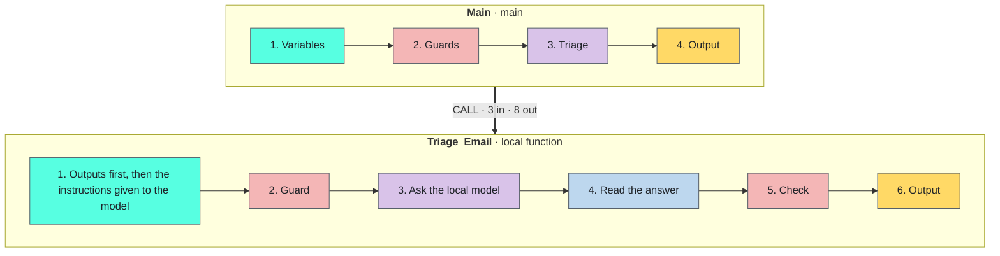

<!-- Generated by tools/build_docs.py from sample.yml and flow/. Edit those, not this file. -->

[All samples](../../README.md) › Email

# Email triage by a local AI model

Sort the emails of a shared inbox by category and urgency with a model that runs on the PC, each with a one-sentence summary; no email leaves the PC.

**Reusable component** · Intermediate · Requires Ollama (free, runs on the PC) with the model llama3.2:3b · Tested on PAD 2.72.183 · v1.0.0

[**Step-by-step setup**](SETUP.md) · [Download the sample (zip)](https://github.com/anne-automates/pad-samples/releases/download/local-ai-email-triage-v1.0.0/local-ai-email-triage-v1.0.0.zip) · [Changelog](CHANGELOG.md)

*For e-learning purposes only: try it in a test environment with the sample data, and review it before any real use. [Disclaimer](../../START-HERE.md#disclaimer)*

<br><sub>The message at the end of Main: the decision for each of the 12 sample emails</sub>

## Try it

From the path that asks the least to the one that asks the most. Stop at the one you need.

| Path | You create | Needs | Time |
|---|---|---|---|
| **[1. Quick try](SETUP.md#1-quick-try)**<br>Four short emails (two in English, two in French) triaged in one block pasted into Main. No subflow, no input or output to create, no file. | Nothing | Ollama with the model llama3.2:3b | 2 min |
| **[2. Reusable version](SETUP.md#2-reusable-version)**<br>The function and its example call, in a flow of their own. | 1 local subflow, 3 inputs, 8 outputs | Ollama (free, runs on the PC) with the model llama3.2:3b | 20 min |
| **[3. In your own flow](#use-it-in-your-flow)**<br>Call `Triage_Email` from the flow you are building. | The subflow, its 11 variables and one CALL line | Your flow | Depends on your flow |

## Problem

A shared inbox (orders, accounts, support) must be sorted before anyone can answer: invoices to accounting, complaints
first, sales pitches aside. Rules on keywords (*If text contains*) miss most of it: they were right for **46 %** of a test
set of 192 emails. A cloud AI service reads better but sends every email, with its names and amounts, out of the company.

## Solution

One *Invoke Local LLM* action asks a language model that runs **on the PC** (Ollama, free, no account, no key). The
model returns a small JSON answer: category, urgency, summary, reply needed. Each field is read with its own regular
expression and the category is checked against the six allowed values; anything else goes to a person. The action is
wrapped in a **local function** (3 inputs, 8 outputs) that never stops the flow: it returns a flag and a message.

**Techniques:** [Local function with a contract](../../TECHNIQUES.md#local-function) · [Errors returned, never thrown](../../TECHNIQUES.md#errors-as-outputs) · [A language model served on the PC](../../TECHNIQUES.md#local-llm) · [JSON answers read field by field](../../TECHNIQUES.md#json-by-regex)

## Use it in your flow

1. Create the local subflow `Triage_Email` and its 3 inputs and 8 outputs ([how](SETUP.md#2-reusable-version)).
2. Paste [`flow/2-Triage_Email.txt`](flow/2-Triage_Email.txt) into it (88 lines).
3. Call it. The example in `Main`:

```text
CALL Triage_Email in_loc_txt_EmailText: txt_EmailText in_loc_txt_Endpoint: txt_Endpoint in_loc_txt_Model: txt_Model out_loc_txt_Category=> txt_Category out_loc_txt_Urgency=> txt_Urgency out_loc_txt_Summary=> txt_Summary out_loc_bool_ReplyNeeded=> bool_ReplyNeeded out_loc_bool_Ok=> bool_Ok out_loc_txt_Error=> txt_Error out_loc_num_ElapsedMs=> num_ElapsedMs out_loc_num_Tokens=> num_Tokens
```

| Inputs | Type | Description | Example |
|---|---|---|---|
| `in_loc_txt_EmailText` | Text | The text of the email: subject line, empty line, body | `Subject: Payment received, order 88213 ...` |
| `in_loc_txt_Endpoint` | Text | The Ollama endpoint on this PC | `http://localhost:11434/v1` |
| `in_loc_txt_Model` | Text | A model already pulled in Ollama | `llama3.2:3b` |

| Outputs | Type | Description | Example |
|---|---|---|---|
| `out_loc_bool_Ok` | Boolean | True when the triage worked and the category is one of the six | `True` |
| `out_loc_txt_Error` | Text | Why it failed; empty when out_loc_bool_Ok is True | `No answer from the model llama3.2:3b at http://localhost:11434/v1. Is Ollama running, and was the model pulled?` |
| `out_loc_txt_Category` | Text | One of invoice, complaint, info_request, appointment, sales_offer, other; empty when out_loc_bool_Ok is False | `complaint` |
| `out_loc_txt_Urgency` | Text | low, normal or high | `high` |
| `out_loc_txt_Summary` | Text | One sentence written by the model | `No update on standing desk order SD-55102 after three weeks` |
| `out_loc_bool_ReplyNeeded` | Boolean | True when the sender expects an answer | `True` |
| `out_loc_num_ElapsedMs` | Number | Time taken by the call to the model | `6300` |
| `out_loc_num_Tokens` | Number | Tokens read and written by the model | `about 380` |

> [!TIP]
> `Triage_Email` never stops the flow. Test `out_loc_bool_Ok` after the call and read `out_loc_txt_Error` when it is False.

## How it works



`Triage_Email`, region by region:

1. **Outputs first, then the instructions given to the model**
2. **Guard**: an empty email is not sent to the model
3. **Ask the local model**: one call, JSON answer, temperature 0 (the same email always gets the same answer)
4. **Read the answer**: one regular expression per field, a missing field stays empty
5. **Check**: only the six categories are accepted, anything else goes to a person
6. **Output**: the category, and the flag that says the triage worked

## Design choices

Measured 2026-10-01, on 192 fictitious emails (96 in English, 96 in French, 6 categories, one third deliberately ambiguous), PC without GPU.

| Approach | Time | Result | Verdict |
|---|---|---|---|
| Native: keyword rules (If text contains) | instant | 46 % right. Every email that names no keyword falls into other. | Use it for a handful of fixed senders or subjects, not for free text. |
| **Chosen: Invoke Local LLM with llama3.2:3b (2 GB), nothing to train** | 6 to 8.5 s per email | 68 % right (74 % in English, 61 % in French), 79 % on the clear emails; always valid JSON, always one of the six categories. Weakest on other: internal notices are read as information requests. | All inside PAD, no labelled data, nothing to install but Ollama: the shortest way to a first sort, checked by a person. |
| Embedding model + a classifier trained on labelled emails (Python) | 0.3 s per email | 92 % right (cross-validated), probabilities usable for a review threshold. | The most accurate, but it needs about 24 labelled emails per category, Python and a script: a second step once a history of sorted emails exists. |

## Performance

- Tested run of 2026-10-01: 12 emails triaged in 157 s by llama3.2:3b on a PC without GPU, 5.2 to 8.3 s per email; the first call takes 25 s while the model loads.
- Quick try of 2026-10-01: 4 emails in 38 s, first call included.
- Measured on 2026-10-01 outside PAD, with the same instructions and settings, on the 192 test emails: median 8.5 s per email, about 380 tokens per email, a valid JSON answer 192 times out of 192.

## Limits

- Needs Ollama on the PC and one model downloaded once (llama3.2:3b is about 2 GB). The flow checks nothing about the installation: a missing model or a stopped Ollama gives the message No answer from the model.
- A small model makes mistakes: 68 % right on the test set of 192 emails, 49 % on the ambiguous ones, and it rarely chooses other. In the tested run, a notice of site closure went to info_request and a request for rates to sales_offer (10 of 12 right). Keep a person in the loop: the flow copies, it never deletes, moves or answers.
- The model gives no reliable confidence score. What it cannot place, or places outside the six categories, goes to to_review; everything else is trusted as it is.
- Summaries are asked in English; the small model sometimes answers in the language of the email (2 of 12 in the tested run).
- The sample reads emails saved as .txt files. Reading Outlook directly (Retrieve email messages) was not tested with this sample.
- Tested on a PC without GPU, with llama3.2:3b. Other models only change the value of txt_Model; their speed and accuracy were not tested in PAD.

## Files

| Subflow | Scope | Lines | Role |
|---|---|---|---|
| [`Main`](flow/1-Main.txt) | Main | 67 | Example call: reads each .txt email of the inbox, calls the function, copies the email into the folder of its category and writes a CSV report. |
| [`Triage_Email`](flow/2-Triage_Email.txt) | Local | 88 | The reusable part: the text of one email in, its category, urgency, summary, reply flag and 4 details out. Never stops the flow. |
| [`Test`](flow/3-Test.txt) | Global | 74 | The quick try: four emails written in the block, triaged by the same action and shown in one message. *(optional)* |

- Sample files, in [`input/`](input/): `email-01.txt`, `email-02.txt`, `email-03.txt`, `email-04.txt`, `email-05.txt`, `email-06.txt`, `email-07.txt`, `email-08.txt`, `email-09.txt`, `email-10.txt`, `email-11.txt`, `email-12.txt`
- Output of the test run, in [`expected/`](expected/): `triage-report.csv`, `triaged-tree.txt`

## Tested on

| PAD version | Date | Path | Result |
|---|---|---|---|
| 2.72.183 | 2026-10-01 | Full flow | Pass |
| 2.72.183 | 2026-10-01 | Quick try | Pass |

Authors: Anne (AI agent), HyperAutomatisation · [Changelog](CHANGELOG.md) · [Report a problem](https://github.com/anne-automates/pad-samples/issues/new?template=sample-does-not-work.yml&title=%5Blocal-ai-email-triage%5D+)
