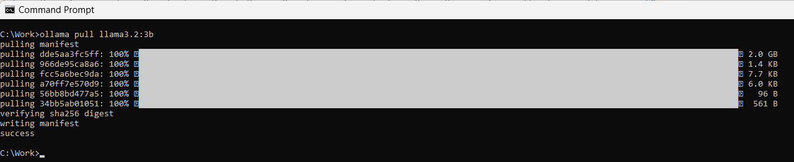
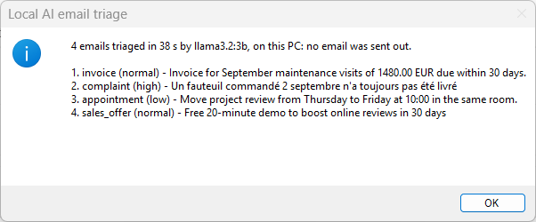
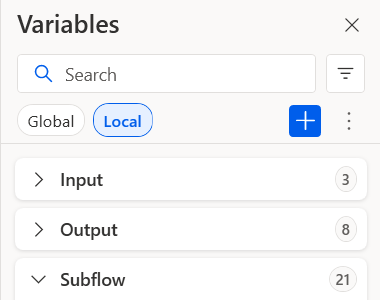
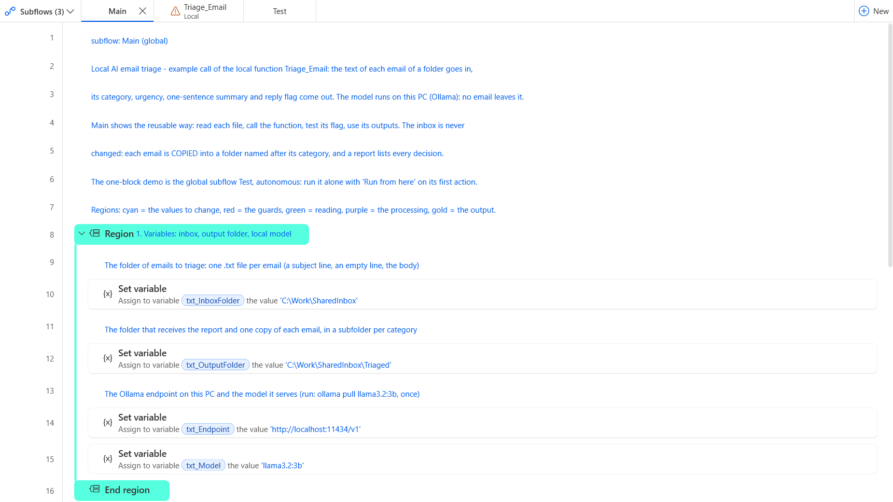
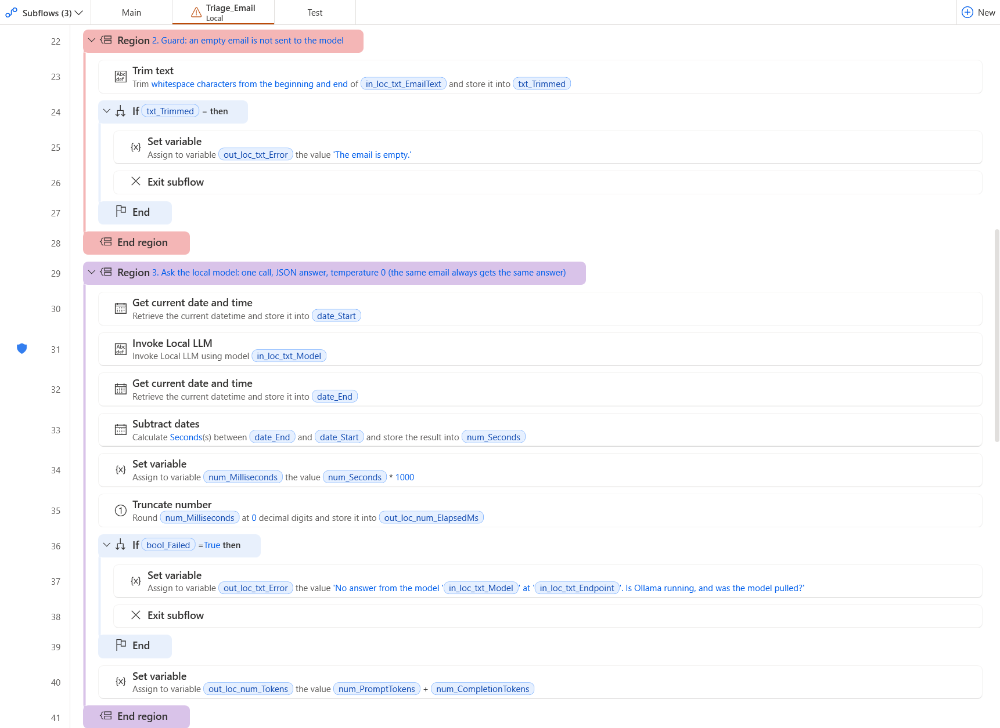
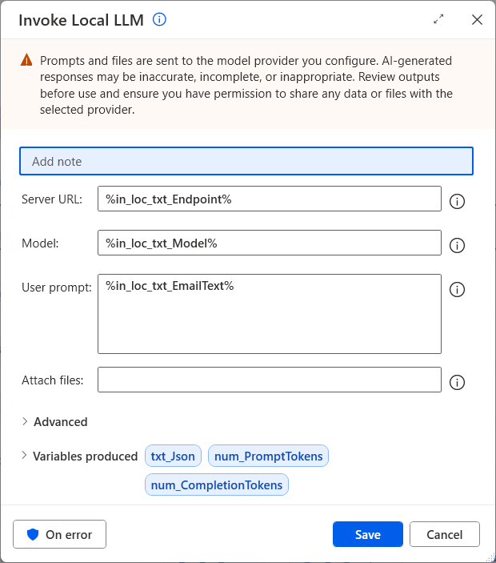
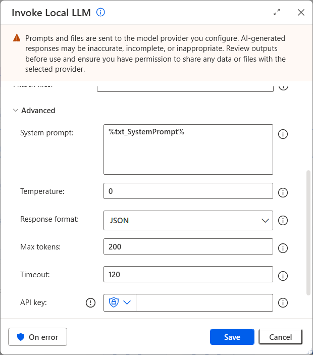
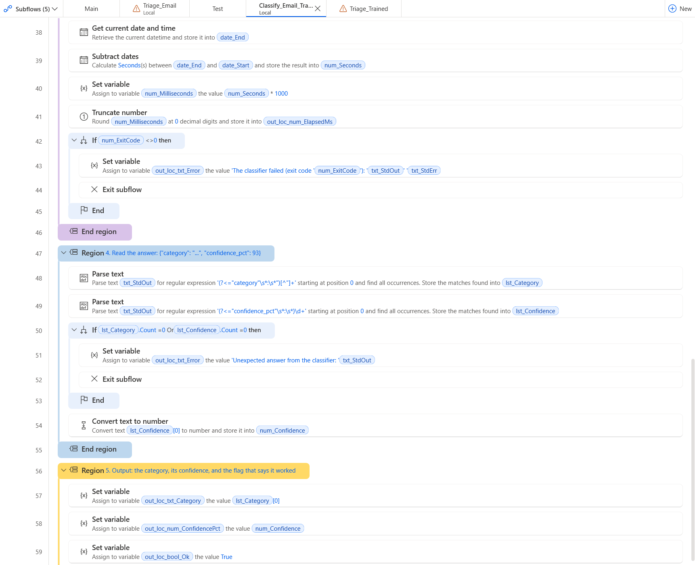
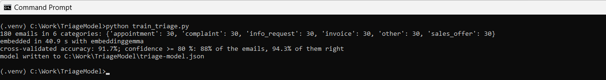
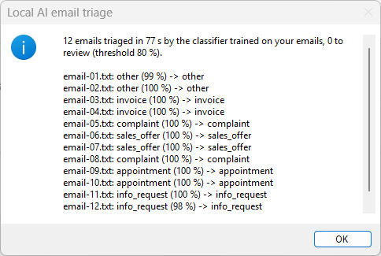

<!-- Generated by tools/build_docs.py from sample.yml and flow/. Edit those, not this file. -->

[All samples](../../README.md) › [Email triage by a local AI model](README.md) › Setup

# Set up: Email triage by a local AI model

Tested on PAD 2.72.183 · v1.1.2

*For e-learning purposes only: try it in a test environment with the sample data, and review it before any real use. [Disclaimer](../../START-HERE.md#disclaimer)*

From the path that asks the least to the one that asks the most. Stop at the one you need.

| Path | You create | Needs | Time |
|---|---|---|---|
| **[1. Quick try](#1-quick-try)**<br>Four short emails (two in English, two in French) triaged in one block pasted into Main. No subflow, no input or output to create, no file. | Nothing | Ollama with the model llama3.2:3b | 2 min |
| **[2. Reusable version](#2-reusable-version)**<br>The function and its example call, in a flow of their own. | 1 local subflow, 3 inputs, 8 outputs | Ollama (free, runs on the PC) with the model llama3.2:3b | 20 min |
| **[3. In your own flow](#3-in-your-own-flow)**<br>Call `Triage_Email` from the flow you are building. | The subflow, its 11 variables and one CALL line | Your flow | Depends on your flow |

## 1. Quick try

Four short emails (two in English, two in French) triaged in one block pasted into Main. No subflow, no input or output to create, no file. Needs Ollama with the model llama3.2:3b.

### 1.1 Install what it needs

**Install Ollama and download the model, once.** Every path asks a model that runs on this PC; the flow installs nothing. Install Ollama from ollama.com. In a command prompt, run: ollama pull llama3.2:3b (about 2 GB). Ollama then serves it at http://localhost:11434/v1, the value of txt_Endpoint.

<br><sub>The model downloaded once: the last line says success</sub>

### 1.2 Paste the block into Main

**+ New flow**, any name, **Create**. Click the empty canvas of `Main`, **Ctrl+V** the block of [`flow/3-Test.txt`](flow/3-Test.txt). Check: 75 lines, Errors pane empty.

<details><summary>The code (75 lines)</summary>

```text
# subflow: Test (global)
# Local AI email triage - the quick try, AUTONOMOUS: four short emails (two in English, two in French) are triaged by a
# model served on this PC by Ollama. Each one gets a category, an urgency and a one-sentence summary; the four answers
# are shown in one message. Nothing to create, no file, no other application: Ollama and one model are enough.
# NO input / output variable: the settings are plain SET lines in the first region, so this subflow can be pasted alone
# into any empty Main. Or run it here with 'Run from here' on its first action.
# The reusable building block is the local function Triage_Email (same instructions, same action), called by Main.
# Regions: cyan values, red guards, purple processing, gold output.
@@regionColor: '#57FFE1'
**REGION 1. Variables: the local model and four sample emails, the only lines to change
# The Ollama endpoint on this PC and the model it serves (run: ollama pull llama3.2:3b, once)
SET txt_Endpoint TO $'''http://localhost:11434/v1'''
SET txt_Model TO $'''llama3.2:3b'''
# Four sample emails, two in English and two in French (a subject line, an empty line, the body): replace them with yours
SET txt_Email1 TO $'''Subject: Invoice 2026-118 for the September maintenance

Hello, please find attached invoice 2026-118 for the maintenance visits of September: 1,480.00 EUR, payable within 30 days by bank transfer. Kind regards, Laura Benning, Northgate Facilities'''
SET txt_Email2 TO $'''Objet : Commande 55721 toujours pas livrée

Bonjour, j\'ai commandé deux fauteuils le 2 septembre avec une livraison promise sous 10 jours. Trois semaines plus tard, rien, et votre service client ne répond pas. Je demande une livraison cette semaine ou le remboursement complet. Hélène Marchetti'''
SET txt_Email3 TO $'''Subject: Can we move Thursday?

Hi Tom, something came up on Thursday afternoon. Could we move our project review to Friday at 10:00, same room? Thanks, Priya'''
SET txt_Email4 TO $'''Objet : Doublez vos avis clients en 30 jours

Bonjour, notre agence Vitrineo aide les commerces de proximité à obtenir plus d\'avis positifs sur internet. Je vous propose une démonstration gratuite de 20 minutes la semaine prochaine. Bien à vous, Julien Ferrand'''
SET lst_Emails TO [txt_Email1, txt_Email2, txt_Email3, txt_Email4]
# The same instructions as in Triage_Email: six categories, three urgencies, a summary in English
SET txt_SystemPrompt TO $'''You triage the emails of a shared inbox. The email can be in any language. Answer with one JSON object only, in this form: {"category": "...", "urgency": "...", "summary": "...", "reply_needed": true}
category, exactly one of: invoice (billing and payments: invoice, payment reminder or confirmation, quote, purchase order, bank details, credit note), complaint (an unhappy customer: late delivery, defect, poor service, disputed bill, refund after a problem), info_request (a question asking for information: prices, hours, documents, availability, how to), appointment (propose, confirm, move or cancel a meeting, a call or a visit), sales_offer (an unsolicited commercial offer, a partnership pitch, cold outreach, a recruiter), other (anything else: internal notice, newsletter, thank-you note, out-of-office, FYI, system notification).
Choose the category of the main intent of the sender, not of every topic mentioned.
urgency, exactly one of: low, normal, high.
summary: one sentence in English, at most 20 words, without double quotes.
reply_needed: true when the sender expects an answer, else false.'''
**ENDREGION
@@regionColor: '#D9C3E9'
**REGION 2. Triage: one call per email, temperature 0, JSON answer read field by field
SET txt_Lines TO $''''''
SET num_Index TO 0
SET bool_Failed TO False
DateTime.GetCurrentDateTime.Local DateTimeFormat: DateTime.DateTimeFormat.DateAndTime CurrentDateTime=> date_Start
LOOP FOREACH txt_Email IN lst_Emails
    SET num_Index TO num_Index + 1
    LLM.InvokeLLM EndpointUrl: txt_Endpoint ModelConfiguration: txt_Model SystemPrompt: txt_SystemPrompt UserPrompt: txt_Email Temperature: 0 ResponseFormat: LLM.ResponseFormatType.Json MaxTokens: 200 Timeout: 120 Response=> txt_Json PromptTokens=> num_PromptTokens CompletionTokens=> num_CompletionTokens
    ON ERROR
        SET bool_Failed TO True
    END
    IF bool_Failed = True THEN
        EXIT LOOP
    END
    Text.ParseText.RegexParse Text: txt_Json TextToFind: $'''(?<="category"\\s*:\\s*")[^"]+''' StartingPosition: 0 IgnoreCase: False Matches=> lst_Category
    Text.ParseText.RegexParse Text: txt_Json TextToFind: $'''(?<="urgency"\\s*:\\s*")[^"]+''' StartingPosition: 0 IgnoreCase: False Matches=> lst_Urgency
    Text.ParseText.RegexParse Text: txt_Json TextToFind: $'''(?<="summary"\\s*:\\s*")[^"]*''' StartingPosition: 0 IgnoreCase: False Matches=> lst_Summary
    SET txt_Category TO $'''?'''
    SET txt_Urgency TO $'''?'''
    SET txt_Summary TO $''''''
    IF lst_Category.Count > 0 THEN
        SET txt_Category TO lst_Category[0]
    END
    IF lst_Urgency.Count > 0 THEN
        SET txt_Urgency TO lst_Urgency[0]
    END
    IF lst_Summary.Count > 0 THEN
        # The summary is JSON text: an accent can arrive as an escape sequence, decoded here through a one-key JSON object
        SET txt_Summary TO lst_Summary[0]
        SET bool_BadSummary TO False
        SET txt_SummaryJson TO $'''{"s": "%lst_Summary[0]%"}'''
        Variables.ConvertJsonToCustomObject Json: txt_SummaryJson CustomObject=> obj_Summary
        ON ERROR
            SET bool_BadSummary TO True
        END
        IF bool_BadSummary = False THEN
            SET txt_Summary TO obj_Summary['s']
        END
    END
    Text.AppendLine Text: txt_Lines LineToAppend: $'''%num_Index%. %txt_Category% (%txt_Urgency%) - %txt_Summary%''' Result=> txt_Lines
END
DateTime.GetCurrentDateTime.Local DateTimeFormat: DateTime.DateTimeFormat.DateAndTime CurrentDateTime=> date_End
DateTime.Subtract FromDate: date_End SubstractDate: date_Start TimeUnit: DateTime.DifferenceTimeUnit.Seconds TimeDifference=> num_Seconds
Variables.TruncateNumber.RoundNumber Number: num_Seconds DecimalPlaces: 0 Result=> num_SecondsRounded
**ENDREGION
@@regionColor: '#F4B6B6'
**REGION 3. Guard: no answer means Ollama is not running or the model is missing
IF bool_Failed = True THEN
    Display.ShowMessageDialog.ShowMessage Title: $'''Local AI email triage''' Message: $'''No answer from the model %txt_Model% at %txt_Endpoint%. Start Ollama, run: ollama pull %txt_Model%, then run again.''' Icon: Display.Icon.ErrorIcon Buttons: Display.Buttons.OK DefaultButton: Display.DefaultButton.Button1 IsTopMost: True ButtonPressed=> _txt_ButtonPressed
    EXIT Code: 0
END
**ENDREGION
@@regionColor: '#FFD966'
**REGION 4. Output: the four decisions on screen
Display.ShowMessageDialog.ShowMessage Title: $'''Local AI email triage''' Message: $'''4 emails triaged in %num_SecondsRounded% s by %txt_Model%, on this PC: no email was sent out.
%txt_Lines%''' Icon: Display.Icon.Information Buttons: Display.Buttons.OK DefaultButton: Display.DefaultButton.Button1 IsTopMost: True ButtonPressed=> _txt_ButtonPressed
**ENDREGION
```

</details>

### 1.3 Run and check

**Run**. Expected:

- A message: 4 emails triaged in 38 s by llama3.2:3b, on this PC: no email was sent out. Then one line per email: invoice, complaint, appointment, sales_offer, with their urgency and a summary.

<br><sub>The message at the end of the quick try</sub>

The values to change are in the first region of `Test` (cyan):

| Variable | Value in the sample | What it is |
|---|---|---|
| `txt_Endpoint` | `http://localhost:11434/v1` | The Ollama endpoint on this PC and the model it serves (run: ollama pull llama3.2:3b, once) |
| `txt_Model` | `llama3.2:3b` | The Ollama endpoint on this PC and the model it serves (run: ollama pull llama3.2:3b, once) |
| `txt_Email1` | `Subject: Invoice 2026-118 for the September maintenance …` | Four sample emails, two in English and two in French (a subject line, an empty line, the body): replace them with yours |
| `txt_Email2` | `Objet : Commande 55721 toujours pas livrée …` | Four sample emails, two in English and two in French (a subject line, an empty line, the body): replace them with yours |
| `txt_Email3` | `Subject: Can we move Thursday? …` | Four sample emails, two in English and two in French (a subject line, an empty line, the body): replace them with yours |
| `txt_Email4` | `Objet : Doublez vos avis clients en 30 jours …` | Four sample emails, two in English and two in French (a subject line, an empty line, the body): replace them with yours |
| `lst_Emails` | `[txt_Email1, txt_Email2, txt_Email3, txt_Email4]` | Four sample emails, two in English and two in French (a subject line, an empty line, the body): replace them with yours |
| `txt_SystemPrompt` | `You triage the emails of a shared inbox. The email can be in any language. Answer with one JSON object only, in this form: {"category": "...", "urgency": "...", "summary": "...", "reply_needed": true} …` | The same instructions as in Triage_Email: six categories, three urgencies, a summary in English |

> [!NOTE]
> Change txt_Model in the first region to try another model you pulled (ollama pull <model>).

## 2. Reusable version

### 2.1 Install what it needs

The same as in 1.1.

### 2.2 Prepare the files

- Copy [`input/*`](input/) into `C:\Work\SharedInbox`. Create the folder first. The flow creates C:\Work\SharedInbox\Triaged by itself and never changes the inbox.
- Copy [`model/*`](model/) into `C:\Work\TriageModel`. Only for the trained classifier (Make it more accurate). The two scripts and 180 sorted emails, one folder per category.

### 2.3 Create the flow and its subflows

**+ New flow**, name `Local AI email triage`, **Create**.
 Then for each subflow: **Subflows** above the canvas › **New**, name, scope, **Save**.

| Subflow name | Scope | Role |
|---|---|---|
| `Triage_Email` | Local | The reusable part: the text of one email in, its category, urgency, summary, reply flag and 4 details out. Never stops the flow. |
| `Classify_Email_Trained` | Local | The trained classifier: one email file in, its category and a confidence in percent out. Never stops the flow. *(optional)* |
| `Triage_Trained` | Global | Example call of the trained classifier on the inbox: a confidence below the threshold goes to to_review. *(optional)* |

> [!WARNING]
> The scope **Local** is easily lost while you type the name. Check it just before **Save**.

Pictures: [Create a subflow](../../docs/create-a-subflow.md).

### 2.4 Create the input and output variables

They must exist before the paste: the code uses them. Type the names exactly.

In `Triage_Email`: **Variables** › **Local** › **+** › **Input** or **Output**, the name only.

```text
in_loc_txt_EmailText
in_loc_txt_Endpoint
in_loc_txt_Model
out_loc_bool_Ok
out_loc_txt_Error
out_loc_txt_Category
out_loc_txt_Urgency
out_loc_txt_Summary
out_loc_bool_ReplyNeeded
out_loc_num_ElapsedMs
out_loc_num_Tokens
```

In `Classify_Email_Trained`: **Variables** › **Local** › **+** › **Input** or **Output**, the name only.

```text
in_loc_txt_EmailFile
in_loc_txt_ModelFolder
in_loc_txt_PythonExe
out_loc_bool_Ok
out_loc_txt_Error
out_loc_txt_Category
out_loc_num_ConfidencePct
out_loc_num_ElapsedMs
```

<br><sub>The function's Variables pane, section Local: Input 3, Output 8</sub>

Descriptions and examples: [the contract](README.md#use-it-in-your-flow). Pictures: [Create input and output variables](../../docs/create-variables.md).

### 2.5 Paste the code

Open the tab of the subflow, click its empty canvas, **Ctrl+V**.

**`Main`** ← [`flow/1-Main.txt`](flow/1-Main.txt). Check: 67 lines, Errors pane empty.

<details><summary>The code (67 lines)</summary>

```text
# subflow: Main (global)
# Local AI email triage - example call of the local function Triage_Email: the text of each email of a folder goes in,
# its category, urgency, one-sentence summary and reply flag come out. The model runs on this PC (Ollama): no email leaves it.
# Main shows the reusable way: read each file, call the function, test its flag, use its outputs. The inbox is never
# changed: each email is COPIED into a folder named after its category, and a report lists every decision.
# The one-block demo is the global subflow Test, autonomous: run it alone with 'Run from here' on its first action.
# Regions: cyan = the values to change, red = the guards, green = reading, purple = the processing, gold = the output.
@@regionColor: '#57FFE1'
**REGION 1. Variables: inbox, output folder, local model
# The folder of emails to triage: one .txt file per email (a subject line, an empty line, the body)
SET txt_InboxFolder TO $'''C:\\Work\\SharedInbox'''
# The folder that receives the report and one copy of each email, in a subfolder per category
SET txt_OutputFolder TO $'''C:\\Work\\SharedInbox\\Triaged'''
# The Ollama endpoint on this PC and the model it serves (run: ollama pull llama3.2:3b, once)
SET txt_Endpoint TO $'''http://localhost:11434/v1'''
SET txt_Model TO $'''llama3.2:3b'''
**ENDREGION
@@regionColor: '#F4B6B6'
**REGION 2. Guards: the inbox must exist and hold emails, the output folder is created when missing
IF (Folder.IfFolderExists.DoesNotExist Path: txt_InboxFolder) THEN
    Display.ShowMessageDialog.ShowMessage Title: $'''Local AI email triage''' Message: $'''Inbox folder not found: %txt_InboxFolder%. Put the sample emails there, or fix txt_InboxFolder in the first region.''' Icon: Display.Icon.ErrorIcon Buttons: Display.Buttons.OK DefaultButton: Display.DefaultButton.Button1 IsTopMost: True ButtonPressed=> _txt_ButtonPressed
    EXIT Code: 1
END
Folder.GetFiles Folder: txt_InboxFolder FileFilter: $'''*.txt''' IncludeSubfolders: False FailOnAccessDenied: True SortBy1: Folder.SortBy.Name SortDescending1: False Files=> lst_Emails
IF lst_Emails.Count = 0 THEN
    Display.ShowMessageDialog.ShowMessage Title: $'''Local AI email triage''' Message: $'''No .txt email in %txt_InboxFolder%.''' Icon: Display.Icon.Warning Buttons: Display.Buttons.OK DefaultButton: Display.DefaultButton.Button1 IsTopMost: True ButtonPressed=> _txt_ButtonPressed
    EXIT Code: 0
END
IF (Folder.IfFolderExists.DoesNotExist Path: txt_OutputFolder) THEN
    # Create folder needs an existing parent: split the path into parent + name first
    File.GetPathPart File: txt_OutputFolder Directory=> fold_OutputParent FileName=> txt_OutputFolderName
    Folder.Create FolderPath: fold_OutputParent FolderName: txt_OutputFolderName Folder=> _fold_Output
END
**ENDREGION
@@regionColor: '#D9C3E9'
**REGION 3. Triage: one call per email, a copy in the folder of its category, one row in the report
Variables.CreateNewDatatable InputTable: { ^['File', 'Category', 'Urgency', 'ReplyNeeded', 'Summary', 'Seconds'], ['', '', '', '', '', ''] } DataTable=> tbl_Report
SET txt_Lines TO $''''''
SET num_ToReview TO 0
DateTime.GetCurrentDateTime.Local DateTimeFormat: DateTime.DateTimeFormat.DateAndTime CurrentDateTime=> date_Start
LOOP FOREACH file_Email IN lst_Emails
    File.ReadTextFromFile.ReadText File: file_Email Encoding: File.TextFileEncoding.UTF8 Content=> txt_EmailText
    CALL Triage_Email in_loc_txt_EmailText: txt_EmailText in_loc_txt_Endpoint: txt_Endpoint in_loc_txt_Model: txt_Model out_loc_txt_Category=> txt_Category out_loc_txt_Urgency=> txt_Urgency out_loc_txt_Summary=> txt_Summary out_loc_bool_ReplyNeeded=> bool_ReplyNeeded out_loc_bool_Ok=> bool_Ok out_loc_txt_Error=> txt_Error out_loc_num_ElapsedMs=> num_ElapsedMs out_loc_num_Tokens=> num_Tokens
    IF bool_Ok = False THEN
        # The function never throws: an email it could not triage goes to a person, with the reason in the report
        SET txt_Category TO $'''to_review'''
        SET txt_Summary TO txt_Error
        SET num_ToReview TO num_ToReview + 1
    END
    SET txt_CategoryFolder TO $'''%txt_OutputFolder%\\%txt_Category%'''
    IF (Folder.IfFolderExists.DoesNotExist Path: txt_CategoryFolder) THEN
        Folder.Create FolderPath: txt_OutputFolder FolderName: txt_Category Folder=> _fold_Category
    END
    File.Copy Files: file_Email Destination: txt_CategoryFolder IfFileExists: File.IfExists.Overwrite CopiedFiles=> _lst_Copied
    SET txt_FileName TO file_Email.Name
    SET num_SecondsRaw TO num_ElapsedMs / 1000
    Variables.TruncateNumber.RoundNumber Number: num_SecondsRaw DecimalPlaces: 1 Result=> num_Seconds
    Variables.AddRowToDataTable.AppendRowToDataTable DataTable: tbl_Report RowToAdd: [txt_FileName, txt_Category, txt_Urgency, bool_ReplyNeeded, txt_Summary, num_Seconds]
    Text.AppendLine Text: txt_Lines LineToAppend: $'''%txt_FileName%: %txt_Category% (%txt_Urgency%) - %txt_Summary%''' Result=> txt_Lines
END
DateTime.GetCurrentDateTime.Local DateTimeFormat: DateTime.DateTimeFormat.DateAndTime CurrentDateTime=> date_End
DateTime.Subtract FromDate: date_End SubstractDate: date_Start TimeUnit: DateTime.DifferenceTimeUnit.Seconds TimeDifference=> num_TotalSeconds
**ENDREGION
@@regionColor: '#FFD966'
**REGION 4. Output: the report as a CSV file, the decisions on screen
Variables.DeleteEmptyRowsFromDataTable DataTable: tbl_Report
SET txt_ReportFile TO $'''%txt_OutputFolder%\\triage-report.csv'''
File.WriteToCSVFile.WriteCSV VariableToWrite: tbl_Report CSVFile: txt_ReportFile CsvFileEncoding: File.CSVEncoding.UTF8 IncludeColumnNames: True IfFileExists: File.IfFileExists.Overwrite ColumnsSeparator: File.CSVColumnsSeparator.Semicolon
Variables.TruncateNumber.RoundNumber Number: num_TotalSeconds DecimalPlaces: 0 Result=> num_TotalRounded
Display.ShowMessageDialog.ShowMessage Title: $'''Local AI email triage''' Message: $'''%lst_Emails.Count% emails triaged in %num_TotalRounded% s by %txt_Model% on this PC, %num_ToReview% to review.
%txt_Lines%
Report: %txt_ReportFile%''' Icon: Display.Icon.Information Buttons: Display.Buttons.OK DefaultButton: Display.DefaultButton.Button1 IsTopMost: True ButtonPressed=> _txt_ButtonPressed
**ENDREGION
```

</details>

<br><sub>Main after the paste: the settings to change</sub>

**`Triage_Email`** ← [`flow/2-Triage_Email.txt`](flow/2-Triage_Email.txt). Check: 88 lines, Errors pane empty.

<details><summary>The code (88 lines)</summary>

```text
# local subflow: Triage_Email
# inputs: in_loc_txt_EmailText, in_loc_txt_Endpoint, in_loc_txt_Model
# outputs: out_loc_bool_Ok, out_loc_txt_Error, out_loc_txt_Category, out_loc_txt_Urgency, out_loc_txt_Summary, out_loc_bool_ReplyNeeded, out_loc_num_ElapsedMs, out_loc_num_Tokens
# One email in, its triage out: category, urgency, a one-sentence summary and whether the sender expects a reply.
# ONE 'Invoke Local LLM' action asks a model served on this PC by Ollama (no account, no key, the email never leaves the PC).
# The answer is JSON; each field is read with a regular expression, so a missing or strange field gives a clear error
# instead of stopping the flow. The function never throws: it returns a flag and a message, the caller decides.
@@regionColor: '#57FFE1'
**REGION 1. Outputs first, then the instructions given to the model
SET out_loc_txt_Category TO $''''''
SET out_loc_txt_Urgency TO $''''''
SET out_loc_txt_Summary TO $''''''
SET out_loc_bool_ReplyNeeded TO False
SET out_loc_bool_Ok TO False
SET out_loc_txt_Error TO $''''''
SET out_loc_num_ElapsedMs TO 0
SET out_loc_num_Tokens TO 0
SET bool_Failed TO False
SET txt_Json TO $''''''
# The six categories are named in the prompt AND checked after the answer: a model can answer outside the list
SET txt_SystemPrompt TO $'''You triage the emails of a shared inbox. The email can be in any language. Answer with one JSON object only, in this form: {"category": "...", "urgency": "...", "summary": "...", "reply_needed": true}
category, exactly one of: invoice (billing and payments: invoice, payment reminder or confirmation, quote, purchase order, bank details, credit note), complaint (an unhappy customer: late delivery, defect, poor service, disputed bill, refund after a problem), info_request (a question asking for information: prices, hours, documents, availability, how to), appointment (propose, confirm, move or cancel a meeting, a call or a visit), sales_offer (an unsolicited commercial offer, a partnership pitch, cold outreach, a recruiter), other (anything else: internal notice, newsletter, thank-you note, out-of-office, FYI, system notification).
Choose the category of the main intent of the sender, not of every topic mentioned.
urgency, exactly one of: low, normal, high.
summary: one sentence in English, at most 20 words, without double quotes.
reply_needed: true when the sender expects an answer, else false.'''
**ENDREGION
@@regionColor: '#F4B6B6'
**REGION 2. Guard: an empty email is not sent to the model
Text.Trim Text: in_loc_txt_EmailText TrimOption: Text.TrimOption.Both TrimmedText=> txt_Trimmed
IF txt_Trimmed = $'''''' THEN
    SET out_loc_txt_Error TO $'''The email is empty.'''
    EXIT FUNCTION
END
**ENDREGION
@@regionColor: '#D9C3E9'
**REGION 3. Ask the local model: one call, JSON answer, temperature 0 (the same email always gets the same answer)
DateTime.GetCurrentDateTime.Local DateTimeFormat: DateTime.DateTimeFormat.DateAndTime CurrentDateTime=> date_Start
LLM.InvokeLLM EndpointUrl: in_loc_txt_Endpoint ModelConfiguration: in_loc_txt_Model SystemPrompt: txt_SystemPrompt UserPrompt: in_loc_txt_EmailText Temperature: 0 ResponseFormat: LLM.ResponseFormatType.Json MaxTokens: 200 Timeout: 120 Response=> txt_Json PromptTokens=> num_PromptTokens CompletionTokens=> num_CompletionTokens
ON ERROR
    SET bool_Failed TO True
END
DateTime.GetCurrentDateTime.Local DateTimeFormat: DateTime.DateTimeFormat.DateAndTime CurrentDateTime=> date_End
DateTime.Subtract FromDate: date_End SubstractDate: date_Start TimeUnit: DateTime.DifferenceTimeUnit.Seconds TimeDifference=> num_Seconds
SET num_Milliseconds TO num_Seconds * 1000
Variables.TruncateNumber.RoundNumber Number: num_Milliseconds DecimalPlaces: 0 Result=> out_loc_num_ElapsedMs
IF bool_Failed = True THEN
    SET out_loc_txt_Error TO $'''No answer from the model %in_loc_txt_Model% at %in_loc_txt_Endpoint%. Is Ollama running, and was the model pulled?'''
    EXIT FUNCTION
END
SET out_loc_num_Tokens TO num_PromptTokens + num_CompletionTokens
**ENDREGION
@@regionColor: '#BDD7EE'
**REGION 4. Read the answer: one regular expression per field, a missing field stays empty
Text.ParseText.RegexParse Text: txt_Json TextToFind: $'''(?<="category"\\s*:\\s*")[^"]+''' StartingPosition: 0 IgnoreCase: False Matches=> lst_Category
Text.ParseText.RegexParse Text: txt_Json TextToFind: $'''(?<="urgency"\\s*:\\s*")[^"]+''' StartingPosition: 0 IgnoreCase: False Matches=> lst_Urgency
Text.ParseText.RegexParse Text: txt_Json TextToFind: $'''(?<="summary"\\s*:\\s*")[^"]*''' StartingPosition: 0 IgnoreCase: False Matches=> lst_Summary
Text.ParseText.RegexParse Text: txt_Json TextToFind: $'''(?<="reply_needed"\\s*:\\s*)(true|false)''' StartingPosition: 0 IgnoreCase: True Matches=> lst_Reply
SET txt_Category TO $''''''
IF lst_Category.Count > 0 THEN
    Text.ChangeCase Text: lst_Category[0] NewCase: Text.CaseOption.LowerCase Result=> txt_Lower
    Text.Trim Text: txt_Lower TrimOption: Text.TrimOption.Both TrimmedText=> txt_Category
END
IF lst_Urgency.Count > 0 THEN
    Text.ChangeCase Text: lst_Urgency[0] NewCase: Text.CaseOption.LowerCase Result=> out_loc_txt_Urgency
END
IF lst_Summary.Count > 0 THEN
    # The summary is JSON text: an accent can arrive as an escape sequence, decoded here through a one-key JSON object
    SET out_loc_txt_Summary TO lst_Summary[0]
    SET bool_BadSummary TO False
    SET txt_SummaryJson TO $'''{"s": "%lst_Summary[0]%"}'''
    Variables.ConvertJsonToCustomObject Json: txt_SummaryJson CustomObject=> obj_Summary
    ON ERROR
        SET bool_BadSummary TO True
    END
    IF bool_BadSummary = False THEN
        SET out_loc_txt_Summary TO obj_Summary['s']
    END
END
IF lst_Reply.Count > 0 THEN
    Text.ChangeCase Text: lst_Reply[0] NewCase: Text.CaseOption.LowerCase Result=> txt_Reply
    IF txt_Reply = $'''true''' THEN
        SET out_loc_bool_ReplyNeeded TO True
    END
END
**ENDREGION
@@regionColor: '#F4B6B6'
**REGION 5. Check: only the six categories are accepted, anything else goes to a person
Text.ParseText.RegexParse Text: txt_Category TextToFind: $'''^(invoice|complaint|info_request|appointment|sales_offer|other)$''' StartingPosition: 0 IgnoreCase: False Matches=> lst_Valid
IF lst_Valid.Count = 0 THEN
    SET out_loc_txt_Error TO $'''Unexpected answer from the model: %txt_Json%'''
    EXIT FUNCTION
END
**ENDREGION
@@regionColor: '#FFD966'
**REGION 6. Output: the category, and the flag that says the triage worked
SET out_loc_txt_Category TO txt_Category
SET out_loc_bool_Ok TO True
**ENDREGION
```

</details>

<br><sub>The function after the paste: the guard and the Invoke Local LLM action</sub>

Double-click an action to check what the paste set in it:

<br><sub>Invoke Local LLM: the server, the model and the text of the email come from the inputs</sub>

<br><sub>Advanced: the instructions, temperature 0, a JSON answer, at most 200 tokens, 120 s</sub>

**`Classify_Email_Trained`** *(optional)* ← [`flow/4-Classify_Email_Trained.txt`](flow/4-Classify_Email_Trained.txt). Check: 63 lines, Errors pane empty.

<details><summary>The code (63 lines)</summary>

```text
# local subflow: Classify_Email_Trained
# inputs: in_loc_txt_EmailFile, in_loc_txt_ModelFolder, in_loc_txt_PythonExe
# outputs: out_loc_bool_Ok, out_loc_txt_Error, out_loc_txt_Category, out_loc_num_ConfidencePct, out_loc_num_ElapsedMs
# One email file in, its category and a confidence in percent out, from the classifier trained on YOUR sorted emails
# (train_triage.py writes triage-model.json; classify_triage.py applies it, with no package to install).
# ONE 'Run DOS command' action runs the script; its one-line JSON answer is read field by field.
# The function never throws: it returns a flag and a message, the caller decides (for example: a low confidence goes to a person).
@@regionColor: '#57FFE1'
**REGION 1. Outputs first, then the two files the call needs
SET out_loc_bool_Ok TO False
SET out_loc_txt_Error TO $''''''
SET out_loc_txt_Category TO $''''''
SET out_loc_num_ConfidencePct TO 0
SET out_loc_num_ElapsedMs TO 0
SET txt_ModelFile TO $'''%in_loc_txt_ModelFolder%\\triage-model.json'''
SET txt_Script TO $'''%in_loc_txt_ModelFolder%\\classify_triage.py'''
SET txt_StdOut TO $''''''
SET num_ExitCode TO -1
**ENDREGION
@@regionColor: '#F4B6B6'
**REGION 2. Guards: the email, the trained model and the script must exist
IF (File.IfFile.DoesNotExist File: in_loc_txt_EmailFile) THEN
    SET out_loc_txt_Error TO $'''Email file not found: %in_loc_txt_EmailFile%'''
    EXIT FUNCTION
END
IF (File.IfFile.DoesNotExist File: txt_ModelFile) THEN
    SET out_loc_txt_Error TO $'''No trained model in %in_loc_txt_ModelFolder%: run train_triage.py there first.'''
    EXIT FUNCTION
END
IF (File.IfFile.DoesNotExist File: txt_Script) THEN
    SET out_loc_txt_Error TO $'''classify_triage.py not found in %in_loc_txt_ModelFolder%'''
    EXIT FUNCTION
END
**ENDREGION
@@regionColor: '#D9C3E9'
**REGION 3. Classify: one Python process per email, about 1 s
# cmd /c drops the first and the last quote of a line that holds several quoted items: the whole line gets one extra pair
SET txt_Command TO $'''""%in_loc_txt_PythonExe%" "%txt_Script%" --model "%txt_ModelFile%" --file "%in_loc_txt_EmailFile%""'''
DateTime.GetCurrentDateTime.Local DateTimeFormat: DateTime.DateTimeFormat.DateAndTime CurrentDateTime=> date_Start
Scripting.RunDosCommand.RunDOSCommandAndFailOnTimeout DOSCommandOrApplication: txt_Command WorkingDirectory: in_loc_txt_ModelFolder Timeout: 120 StandardOutput=> txt_StdOut StandardError=> txt_StdErr ExitCode=> num_ExitCode
ON ERROR
    SET num_ExitCode TO -1
END
DateTime.GetCurrentDateTime.Local DateTimeFormat: DateTime.DateTimeFormat.DateAndTime CurrentDateTime=> date_End
DateTime.Subtract FromDate: date_End SubstractDate: date_Start TimeUnit: DateTime.DifferenceTimeUnit.Seconds TimeDifference=> num_Seconds
SET num_Milliseconds TO num_Seconds * 1000
Variables.TruncateNumber.RoundNumber Number: num_Milliseconds DecimalPlaces: 0 Result=> out_loc_num_ElapsedMs
IF num_ExitCode <> 0 THEN
    SET out_loc_txt_Error TO $'''The classifier failed (exit code %num_ExitCode%): %txt_StdOut% %txt_StdErr%'''
    EXIT FUNCTION
END
**ENDREGION
@@regionColor: '#BDD7EE'
**REGION 4. Read the answer: {"category": "...", "confidence_pct": 93}
Text.ParseText.RegexParse Text: txt_StdOut TextToFind: $'''(?<="category"\\s*:\\s*")[^"]+''' StartingPosition: 0 IgnoreCase: False Matches=> lst_Category
Text.ParseText.RegexParse Text: txt_StdOut TextToFind: $'''(?<="confidence_pct"\\s*:\\s*)\\d+''' StartingPosition: 0 IgnoreCase: False Matches=> lst_Confidence
IF lst_Category.Count = 0 OR lst_Confidence.Count = 0 THEN
    SET out_loc_txt_Error TO $'''Unexpected answer from the classifier: %txt_StdOut%'''
    EXIT FUNCTION
END
Text.ToNumber Text: lst_Confidence[0] Number=> num_Confidence
**ENDREGION
@@regionColor: '#FFD966'
**REGION 5. Output: the category, its confidence, and the flag that says it worked
SET out_loc_txt_Category TO lst_Category[0]
SET out_loc_num_ConfidencePct TO num_Confidence
SET out_loc_bool_Ok TO True
**ENDREGION
```

</details>

<br><sub>The trained function after the paste: the answer of the script read field by field</sub>

**`Triage_Trained`** *(optional)* ← [`flow/5-Triage_Trained.txt`](flow/5-Triage_Trained.txt). Check: 75 lines, Errors pane empty.

<details><summary>The code (75 lines)</summary>

```text
# subflow: Triage_Trained (global)
# Local AI email triage, trained on your own emails - example call of the local function Classify_Email_Trained.
# The same job as Main, with the classifier trained on emails a person already sorted (one folder per category):
# each email is copied into the folder of its category, unless the confidence is below the threshold: then it goes to
# to_review, for a person. A report lists every decision with its confidence. The inbox is never changed.
# Before the first run: train the classifier once (python train_triage.py, in the model folder). Run this subflow alone
# with 'Run from here' on its first action.
# Regions: cyan = the values to change, red = the guards, purple = the processing, gold = the output.
@@regionColor: '#57FFE1'
**REGION 1. Variables: inbox, output folder, model folder, threshold
# The folder of emails to triage: one .txt file per email (a subject line, an empty line, the body)
SET txt_InboxFolder TO $'''C:\\Work\\SharedInbox'''
# The folder that receives the report and one copy of each email, in a subfolder per category
SET txt_OutputFolder TO $'''C:\\Work\\SharedInbox\\Triaged-trained'''
# The folder of train_triage.py, classify_triage.py and the triage-model.json the training wrote
SET txt_ModelFolder TO $'''C:\\Work\\TriageModel'''
# The Python that runs the classifier (python, py, or a full path to python.exe)
SET txt_PythonExe TO $'''python'''
# Below this confidence (in percent) the email goes to to_review instead of its category
SET num_ThresholdPct TO 80
**ENDREGION
@@regionColor: '#F4B6B6'
**REGION 2. Guards: the inbox must exist and hold emails, the output folder is created when missing
IF (Folder.IfFolderExists.DoesNotExist Path: txt_InboxFolder) THEN
    Display.ShowMessageDialog.ShowMessage Title: $'''Local AI email triage''' Message: $'''Inbox folder not found: %txt_InboxFolder%. Put the sample emails there, or fix txt_InboxFolder in the first region.''' Icon: Display.Icon.ErrorIcon Buttons: Display.Buttons.OK DefaultButton: Display.DefaultButton.Button1 IsTopMost: True ButtonPressed=> _txt_ButtonPressed
    EXIT Code: 1
END
Folder.GetFiles Folder: txt_InboxFolder FileFilter: $'''*.txt''' IncludeSubfolders: False FailOnAccessDenied: True SortBy1: Folder.SortBy.Name SortDescending1: False Files=> lst_Emails
IF lst_Emails.Count = 0 THEN
    Display.ShowMessageDialog.ShowMessage Title: $'''Local AI email triage''' Message: $'''No .txt email in %txt_InboxFolder%.''' Icon: Display.Icon.Warning Buttons: Display.Buttons.OK DefaultButton: Display.DefaultButton.Button1 IsTopMost: True ButtonPressed=> _txt_ButtonPressed
    EXIT Code: 0
END
IF (Folder.IfFolderExists.DoesNotExist Path: txt_OutputFolder) THEN
    # Create folder needs an existing parent: split the path into parent + name first
    File.GetPathPart File: txt_OutputFolder Directory=> fold_OutputParent FileName=> txt_OutputFolderName
    Folder.Create FolderPath: fold_OutputParent FolderName: txt_OutputFolderName Folder=> _fold_Output
END
**ENDREGION
@@regionColor: '#D9C3E9'
**REGION 3. Triage: one call per email; a low confidence goes to a person
Variables.CreateNewDatatable InputTable: { ^['File', 'Category', 'ConfidencePct', 'Decision', 'Seconds'], ['', '', '', '', ''] } DataTable=> tbl_Report
SET txt_Lines TO $''''''
SET num_ToReview TO 0
DateTime.GetCurrentDateTime.Local DateTimeFormat: DateTime.DateTimeFormat.DateAndTime CurrentDateTime=> date_Start
LOOP FOREACH file_Email IN lst_Emails
    CALL Classify_Email_Trained in_loc_txt_EmailFile: file_Email.FullName in_loc_txt_ModelFolder: txt_ModelFolder in_loc_txt_PythonExe: txt_PythonExe out_loc_bool_Ok=> bool_Ok out_loc_txt_Error=> txt_Error out_loc_txt_Category=> txt_Category out_loc_num_ConfidencePct=> num_ConfidencePct out_loc_num_ElapsedMs=> num_ElapsedMs
    SET txt_Decision TO txt_Category
    IF bool_Ok = False THEN
        # The function never throws: an email it could not classify goes to a person, with the reason in the report
        SET txt_Decision TO $'''to_review'''
        SET txt_Category TO txt_Error
    ELSE IF num_ConfidencePct < num_ThresholdPct THEN
        SET txt_Decision TO $'''to_review'''
    END
    IF txt_Decision = $'''to_review''' THEN
        SET num_ToReview TO num_ToReview + 1
    END
    SET txt_DecisionFolder TO $'''%txt_OutputFolder%\\%txt_Decision%'''
    IF (Folder.IfFolderExists.DoesNotExist Path: txt_DecisionFolder) THEN
        Folder.Create FolderPath: txt_OutputFolder FolderName: txt_Decision Folder=> _fold_Decision
    END
    File.Copy Files: file_Email Destination: txt_DecisionFolder IfFileExists: File.IfExists.Overwrite CopiedFiles=> _lst_Copied
    SET txt_FileName TO file_Email.Name
    SET num_SecondsRaw TO num_ElapsedMs / 1000
    Variables.TruncateNumber.RoundNumber Number: num_SecondsRaw DecimalPlaces: 1 Result=> num_Seconds
    Variables.AddRowToDataTable.AppendRowToDataTable DataTable: tbl_Report RowToAdd: [txt_FileName, txt_Category, num_ConfidencePct, txt_Decision, num_Seconds]
    Text.AppendLine Text: txt_Lines LineToAppend: $'''%txt_FileName%: %txt_Category% (%num_ConfidencePct% %%) -> %txt_Decision%''' Result=> txt_Lines
END
DateTime.GetCurrentDateTime.Local DateTimeFormat: DateTime.DateTimeFormat.DateAndTime CurrentDateTime=> date_End
DateTime.Subtract FromDate: date_End SubstractDate: date_Start TimeUnit: DateTime.DifferenceTimeUnit.Seconds TimeDifference=> num_TotalSeconds
**ENDREGION
@@regionColor: '#FFD966'
**REGION 4. Output: the report as a CSV file, the decisions on screen
Variables.DeleteEmptyRowsFromDataTable DataTable: tbl_Report
SET txt_ReportFile TO $'''%txt_OutputFolder%\\triage-report.csv'''
File.WriteToCSVFile.WriteCSV VariableToWrite: tbl_Report CSVFile: txt_ReportFile CsvFileEncoding: File.CSVEncoding.UTF8 IncludeColumnNames: True IfFileExists: File.IfFileExists.Overwrite ColumnsSeparator: File.CSVColumnsSeparator.Semicolon
Variables.TruncateNumber.RoundNumber Number: num_TotalSeconds DecimalPlaces: 0 Result=> num_TotalRounded
Display.ShowMessageDialog.ShowMessage Title: $'''Local AI email triage''' Message: $'''%lst_Emails.Count% emails triaged in %num_TotalRounded% s by the classifier trained on your emails, %num_ToReview% to review (threshold %num_ThresholdPct% %%).
%txt_Lines%
Report: %txt_ReportFile%''' Icon: Display.Icon.Information Buttons: Display.Buttons.OK DefaultButton: Display.DefaultButton.Button1 IsTopMost: True ButtonPressed=> _txt_ButtonPressed
**ENDREGION
```

</details>

Optional: keep the quick try in the same flow, in a global subflow `Test` ([`flow/3-Test.txt`](flow/3-Test.txt)).

### 2.6 Run and check

Tab `Main`, **Run**. Expected:

- A message: 12 emails triaged in about 160 s by llama3.2:3b on this PC, 0 to review, then one line per email with its category, urgency and summary.
- C:\Work\SharedInbox\Triaged holds one folder per category with a copy of each email, and triage-report.csv (identical decisions to expected/triage-report.csv).

```text
C:\Work\SharedInbox\Triaged
+-- appointment
|   +-- email-09.txt
|   +-- email-10.txt
+-- complaint
|   +-- email-05.txt
|   +-- email-08.txt
+-- info_request
|   +-- email-01.txt
|   +-- email-11.txt
+-- invoice
|   +-- email-03.txt
|   +-- email-04.txt
+-- other
|   +-- email-02.txt
+-- sales_offer
|   +-- email-06.txt
|   +-- email-07.txt
|   +-- email-12.txt
+-- triage-report.csv
```

<br><sub>The message at the end of the run</sub>

### 2.7 Adapt it to your data

The values to change are in the first region of `Main` (cyan):

| Variable | Value in the sample | What it is |
|---|---|---|
| `txt_InboxFolder` | `C:\Work\SharedInbox` | The folder of emails to triage: one .txt file per email (a subject line, an empty line, the body) |
| `txt_OutputFolder` | `C:\Work\SharedInbox\Triaged` | The folder that receives the report and one copy of each email, in a subfolder per category |
| `txt_Endpoint` | `http://localhost:11434/v1` | The Ollama endpoint on this PC and the model it serves (run: ollama pull llama3.2:3b, once) |
| `txt_Model` | `llama3.2:3b` | The Ollama endpoint on this PC and the model it serves (run: ollama pull llama3.2:3b, once) |

## 3. In your own flow

1. In your flow, create the local subflow `Triage_Email` and its variables, as in 2.2 and 2.3.
2. Paste [`flow/2-Triage_Email.txt`](flow/2-Triage_Email.txt) into it.
3. Where you need it, add the CALL line and bind each output to a variable of your flow: [the contract](README.md#use-it-in-your-flow).

## 4. Make it more accurate: train it on your own emails

The language model reads every email without knowing your categories as your team uses them. A **classifier trained on
emails a person already sorted** learns them. The training does not touch the language model: a small embedding model
(embeddinggemma, 621 MB, also served by Ollama) turns each email into a vector of 768 numbers, and a logistic regression
learns, in seconds on the CPU, which vectors belong to which category. It also gives a **confidence you can trust**, so
that doubtful emails go to a person and the others are sorted alone. Measured on 2026-10-01 on the 192 test emails,
with the same embedding model, by cross-validation (each email scored by a model that never saw it):

| Sorted emails per category | Accuracy | What it takes |
|---|---|---|
| 0 (the language model of this sample) | 68 % | Ollama only |
| 2 | 74 % | Python, one training run |
| 4 | 83 % | Python, one training run |
| 8 | 87 % | Python, one training run |
| 16 | 90 % | Python, one training run |
| 24 | 92 % | Python, one training run |

1. Keep the emails a person already sorted, one folder per category. The sample gives 180 fictitious ones in `model\Sorted` (30 per category, none of them in the inbox of the sample): copy `model\*` into `C:\Work\TriageModel`.
2. Download the embedding model once: `ollama pull embeddinggemma`.
3. In a command prompt, in `C:\Work\TriageModel`: `python -m venv .venv`, then `.venv\Scripts\activate`, then `pip install numpy scikit-learn`, then `python train_triage.py`. In about a minute it prints the cross-validated accuracy and writes `triage-model.json`.
4. Create the optional subflows `Classify_Email_Trained` (local) and `Triage_Trained` (global) with their variables, paste them, and run `Triage_Trained` with **Run from here** on its first action. `classify_triage.py` needs Python only, no package.
5. Below `num_ThresholdPct` (80 by default) an email goes to `to_review`. When a person files it in the right folder of `Sorted`, run `python train_triage.py` again: the classifier learns from the corrections.

<br><sub>The training run: 180 emails, 91.7 % cross-validated, the model written after 41 s of embedding</sub>

<br><sub>Triage_Trained on the 12 sample emails: 12 of 12, each with its confidence</sub>

## Troubleshooting

| Symptom | Fix |
|---|---|
| Every email lands in to_review with No answer from the model. | Ollama is not running or the model is missing. Open a command prompt, run ollama list: the model of txt_Model must be listed. If not, run ollama pull llama3.2:3b. |
| The first email takes 20 to 30 s, the next ones about 6 s. | Normal. The first call loads the model in memory; Ollama keeps it loaded for 5 minutes. |
| Triage_Trained sends every email to to_review: No trained model in C:\Work\TriageModel. | Run python train_triage.py in that folder first (step 3 of Make it more accurate); it writes triage-model.json. |
| The report of Triage_Trained says: The classifier failed (exit code 9009). | Windows does not find python. Set txt_PythonExe to py, or to the full path of python.exe, in the first region of Triage_Trained. |
| The Errors pane lists unknown variables after the paste into the function. | A contract name differs from the table of the step that creates them. Fix the name in the Variables pane (capitals count); the errors disappear. |
| The new subflow appears under Global, not Local. | The scope is easily lost while typing the name. Delete the subflow and create it again; check Local just before Save. |

Other cases: [Troubleshooting a paste](../../docs/troubleshooting.md) · [report a problem](https://github.com/anne-automates/pad-samples/issues/new?template=sample-does-not-work.yml&title=%5Blocal-ai-email-triage%5D+).
